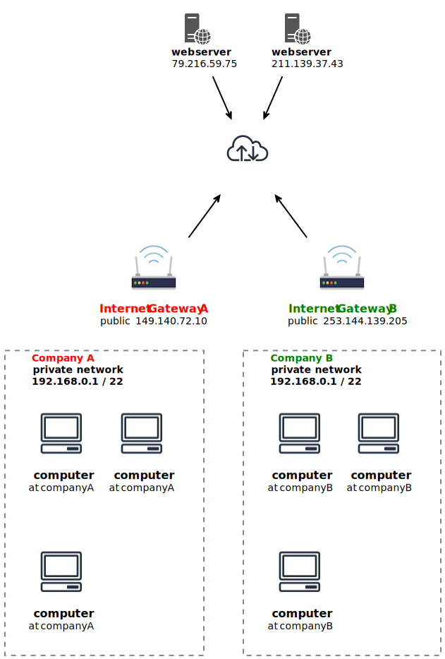

* [Return to table of contents](../../README.md)
# Basic Networking

## 0a.1 Introduction
- Networking has two sorts of IPs. IPv4 and IPv6:\
    - IPv4:1.160.10.240\
    - IPv6:3ffe:1900:4545:3:200:f8ff:fe21:67cf\
- we will only be using IPv4. IPv4 is still the most common format used online.
- Three main blocks established by IANA:
  - 10.0.0.0 – 10.255.255.255 (10.0.0.0 **/8**): Often utilized in large networks. "**/8**" means first **8** bits are fixed.
  - 172.16.0.0 – 172.31.255.255 (172.16.0.0 **/12**): Default range for AWS VPCs. "**/12**" means first **12** bits are fixed.
  - 192.168.0.0 – 192.168.255.255 (192.168.0.0 **/16**): Frequently employed in home. "**/16**" means first **16** bits are fixed.
    
- Ranges:
  - **/ 32** --> $`2^{(32 - 32)} = 2^0 = 1`$    ------ range [192.168.0.0]
  - **/ 31** --> $`2^{(32 - 31)} = 2^1 = 2`$    ------ range [192.168.0.0 - 192.168.0.1]  
  - **/ 30** --> $`2^{(32 - 30)} = 2^2 = 4`$    ------ range [192.168.0.0 - 192.168.0.3]
  - **/ 29** --> $`2^{(32 - 29)} = 2^3 = 8`$    ------ range [192.168.0.0 - 192.168.0.7]
  - **/ 28** --> $`2^{(32 - 28)} = 2^4 = 16`$   ---- range [192.168.0.0 - 192.168.0.15]
  - **/ 27** --> $`2^{(32 - 27)} = 2^5 = 32`$   ---- range [192.168.0.0 - 192.168.0.31]
  - **/ 26** --> $`2^{(32 - 26)} = 2^6 = 64`$   ---- range [192.168.0.0 - 192.168.0.63]
  - **/ 25** --> $`2^{(32 - 25)} = 2^7 = 128`$  --- range [192.168.0.0 - 192.168.0.127]
  - **/ 24** --> $`2^{(32 - 24)} = 2^8 = 256`$  --- range [192.168.0.0 - 192.168.0.255]

[Convert from CIDR to ip-range & viceversa](https://www.ipaddressguide.com/cidr)

## 0a.2 Private
- Private IP means the machine can only be identified on a private network only
- The IP must be unique across the private network
- BUT two different private networks (two companies) can have the same IPs.
- Machines connect to WWW using a **_NAT + internet gateway (a proxy)_**
- Only a specified range of IPs can be used as private IP

## 0a.3 Public
- Public IP means the machine can be identified on the internet (WWW)
- Must be unique across the whole web (not two machines can have the same public IP). 
- Can be geo-located easily

## 0a.4 Private vs Public IP

