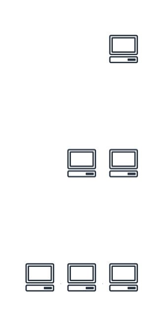

* [Return to table of contents](../../README.md)
# 0b Basic Scalability
## 0b.1 Vertical Scalability
- Vertically scalability means increasing the size of the instance (CPU, RAM, Storage, ...)
 For example, your application runs on a t2.micro then Scaling vertically means running it on a t2.large
- Vertical scalability is very common for non distributed systems, such as a database: RDS, ElastiCache are services that can scale ver tically.
- There’s usually a limit to how much you can vertically scale (hardware limit)

## 0b.2 Horizontal Scalability
- Involves adding or removing more machines (or instances) to your application or system. Instead of
making an individual machine more powerful, you distribute the load
across multiple machines.
- Implies distributed systems. This is very common for web applications & modern applications

## 0b.3 High availability
- High Availability usually goes hand in hand with horizontal scaling. The goal of high availability is to survive a data center loss
- High availability means running your application / system in at least 2 data centers (== Availability Zones).

## 0b.4 High Availability & Scalability For EC2
- Vertical Scaling: Increase instance size (= scale up / down) 
  - From: t2.nano - 0.5G of RAM, 1 vCPU 
  - To: u-12tb1.metal – 12.3 TB of RAM, 448 vCPUs
- Horizontal Scaling: Increase / decrease number of instances (= scale out / in) 
  - [Auto Scaling](./003-ec2.md#314-ec2-autoscaling)
  - [AWS-Elastic Load Balancer (ELB)](./005-ElasticLoadBalancer.md)
- High Availability: Run instances for the same application across multi AZ
  - Auto Scaling Group multi AZ
  - Load Balancer multi AZ