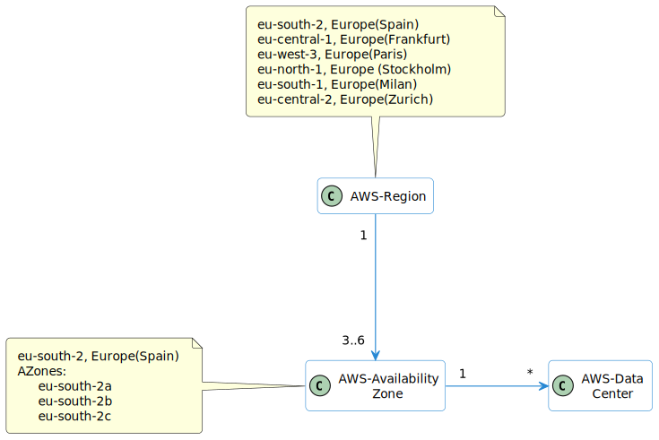

* [Return to table of contents](../../README.md)
# 0-Regions & zones

## 0.1 Domain model

## 0.2 Regions
- **Compliance** with data governance and legal requirements: data never leaves a region without your explicit permission
- **Proximity** to customers: reduced latency
- **Available** services within a Region: new services
and new features aren’t available in every Region
?
- **Pricing** pricing varies region to region and is transparent in the service pricing page

## 0.3 Zones
- Each availability zone (AZ) is one or more discrete data centers with redundant power, networking, and connectivity
- They’re separate from each other, so that they’re isolated from disasters
- They’re connected with high bandwidth, ultra-low latency networking