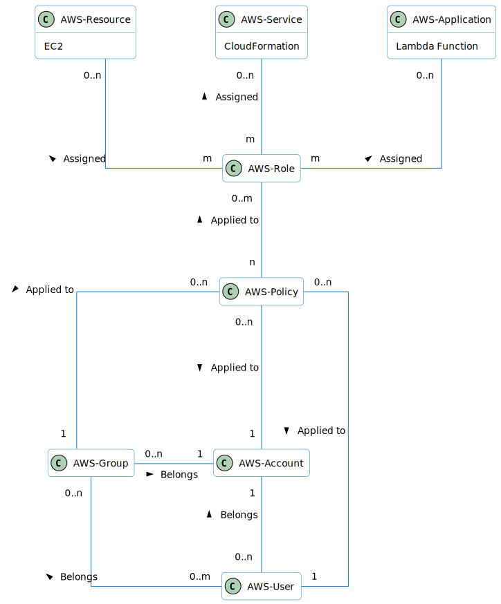
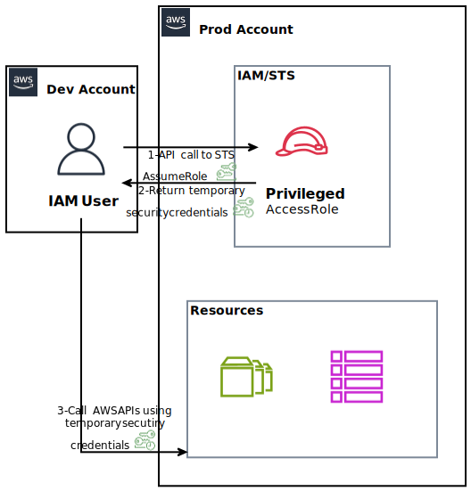

# IAM

## Domain Model

<br/>

- *Users*: Individual entities with granted access to AWS resources.
- *Groups*: to manage and apply policies to multiple users simultaneously.
- *Policies*: Define permissions and can be attached to Users, Groups or Roles. 
Policies specify what actions are allowed or denied on what resources.
  ```
    {
      "Version": "2012-10-17", 
      "Statement": [
                    {
                      "Effect": "Allow",
                      "Action": "ec2:Describe*", 
                      "Resource": "*"
                    },
                    {
                      "Effect": "Allow",
                      "Action": "elasticloadbalancing:Describe*", 
                      "Resource": "*"
                    },
                    {
                      "Effect": "Allow",
                      "Action": [
                            "cloudwatch:ListMetrics", 
                            "cloudwatch:GetMetricStatistics", 
                            "cloudwatch:Describe*"
                      ],
                      "Resource": "*"
                    }
      ]
    }
  ```

  - ***Version***: Language version
  - ***Id***: Policy identifier
  - ***Sid***: Statement identifier
  - ***Effect***: Allow or Deny
  - ***Principal***: account - user - group - role
  - ***Resource***: list of resources where this actions & effects are applied.
  - ***Action***: list of actions that policy allow or deny
    
  ```
  {
      "Version": "2012-10-17", 
      "Id": "S3-Account-Permission",
      "Statement": [
                    {
                      "sid": "1",
                      "Effect": "Allow",
                      "Principal": {
                          "AWS": ["arn:aws:iam:123456789012:root"]
                      }, 
                      "Action": [
                              "s3:GetObject",
                              "s3:PutObject"
                      ], 
                      "Resource":["arn:aws:s3:::myBucket/*"]
                    }
    ]
  }
  ```
- *Roles*: Some AWS service will need to perform actions on your behalf. 
Role is a temporary set of permissions (policies) assigned to AWS-Services (resources). 

## Access keys
- Access Keys, generated through the AWS Console, are used to access 
AWS Resources through CLI (command line interface - terminal) / SDKs (software development kits).
  - *Access Key ID* serves a role similar to a username.
  - *Secret Access Key* functions like a password.

## AWS-STS
AWS Security Token Service (AWS STS): Allows users to request  temporary security 
credentials dynamically. Useful for providing temporary access to resources, 
minimizing the exposure of long-term credentials.


## Multiple AWS Accounts
- AWS Control Tower: Helps set up and govern a secure multi-account AWS
  environment. It automates the setup of AWS accounts, and it enforces 
  governance using AWS Organizations.
- Service Control Policies (SCPs): Allow organizations to set fine-grained
  permissions for their AWS accounts. SCPs are used to control access to
  AWS services across accounts, helping to ensure compliance.

## Best practices
- One physical user === One AWS-User
- All IAM users and root accounts through "robust password policy" & "multi-factor authentication" (MFA)
- Assign users to groups and assign permissions (policies) to user, groups & roles.
- Flexible authorization model using IAM *users, groups, roles, and policies*. 
Create and use *roles* to give permissions (policies) to AWS resources & services (EC2, lambda functions, ...)
- Cross-Account Access: Grant permissions to AWS-Resources from another AWS account. Useful when different accounts
  need to collaborate securely.
- Use Access Keys for Programmatic Access (CLI / SDK)

## IAM Security tools
- IAM Credentials Report (account-level) \
A report that lists all your account's users and the status of their various
credentials
  <br/>
  <br/>
- IAM Access Advisor (user-level) \
   - Access advisor shows the service permissions granted to a user and when those
services were last accessed.
   - You can use this information to review your policies.