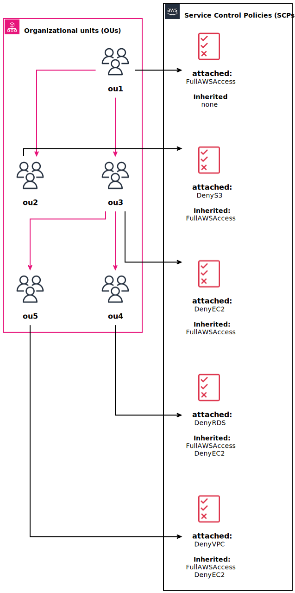
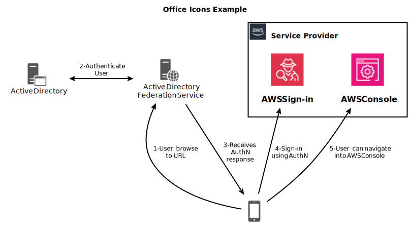

# Control Tower

## Designing a Security Strategy for Multiple AWS Accounts
- AWS Control Tower: Helps set up and govern a secure multi-account AWS
environment. It automates the setup of AWS accounts, and it enforces 
governance using AWS Organizations.
- Service Control Policies (SCPs): Allow organizations to set fine-grained
  permissions for their AWS accounts. SCPs are used to control access to
  AWS services across accounts, helping to ensure compliance.

- IAM policies are focused on defining permissions for individual IAM entities
  (users, groups, roles)
- SCPs operate at the organizational level and provide top-
   down control over the services and actions that are allowed or denied across
   multiple AWS accounts.

## Federate a Directory Service with IAM Roles
- Federating a directory service involves the integration of AWS IAM with an external identity
provider (IdP), such as Keycloak or Microsoft Active Directory or an LDAP-based system. 
This allows users to access AWS resources using their existing corporate credentials. 
Federation enhances security, centralizes identity management, and simplifies user access to AWS services.

