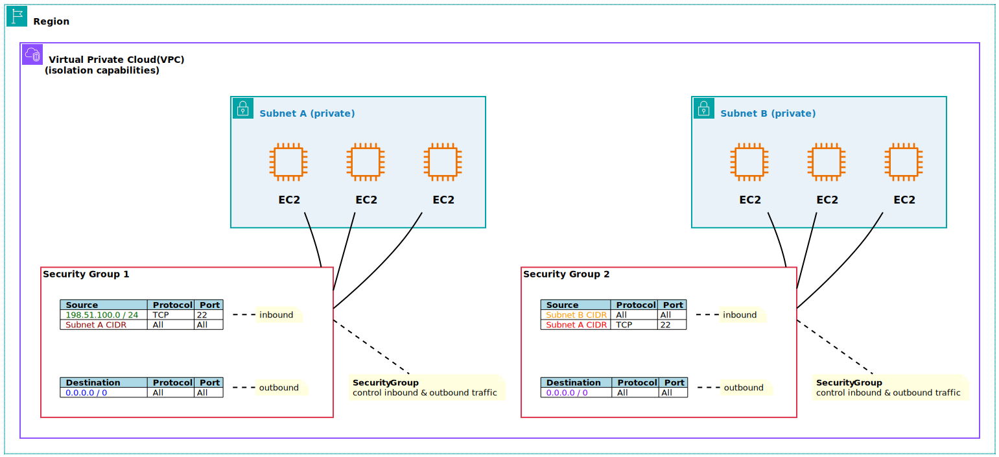
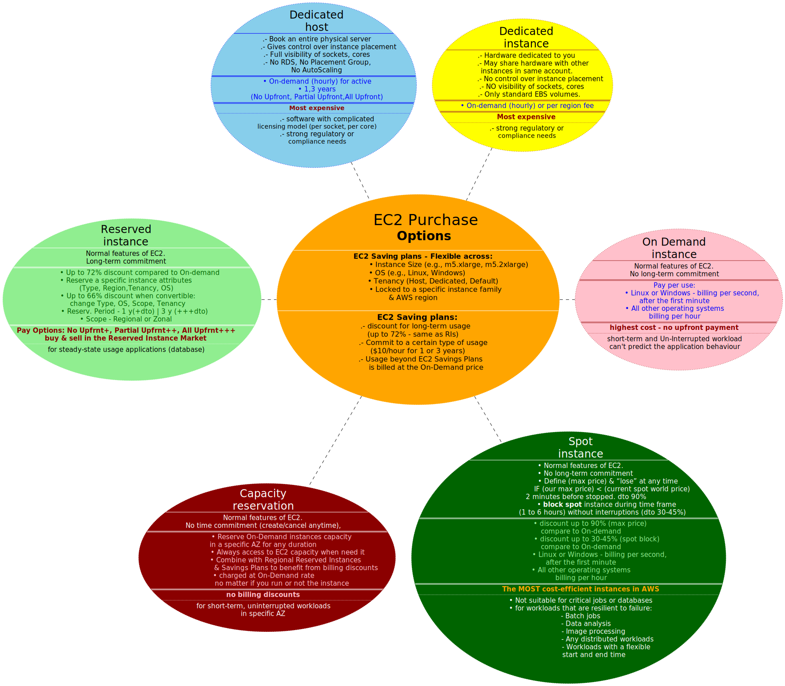
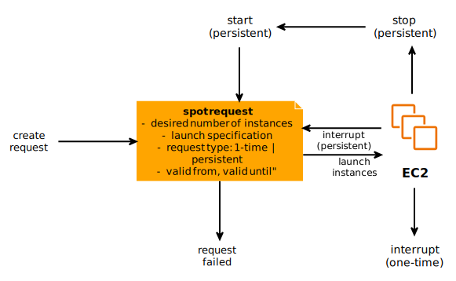
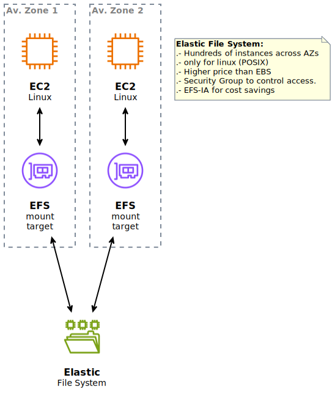
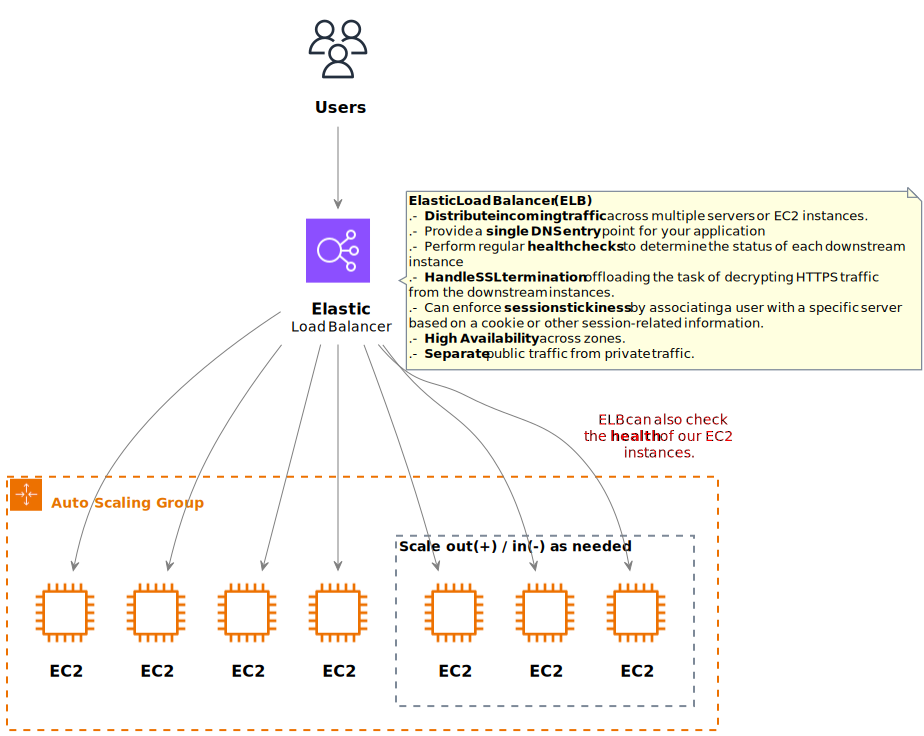
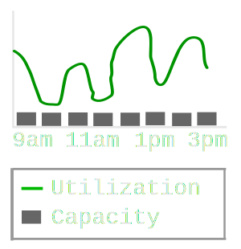
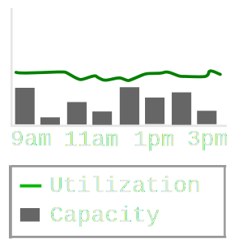
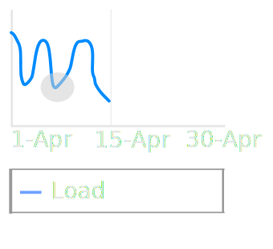
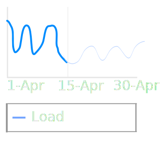
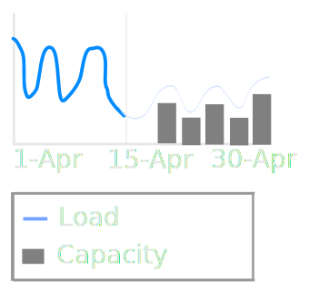

# (EC2) Elastic Compute Cloud

- **Rent Virtual Machines:** EC2 allows users to rent
  virtual machines, known as instances, tailored to specific requirements
  such as compute power, memory and storage.
- **Storing Data:** storage options include Elastic Block Store (EBS) for
  virtual drives and Elastic File System (EFS) for network-attached
  storage. EC2 instances can also leverage Instance Store, offering
  ephemeral storage directly attached to the host machine.
   
   
  
- **Distributing WorkLoad:** Elastic Load Balancer (ELB) facilitates the
  distribution of incoming application traffic across multiple EC2
  instances.
- **Scaling Services:** Auto Scaling Groups (ASG) enable automatic scaling of
  EC2 instances based on predefined criteria. This ensures that
  applications can dynamically adapt to varying workloads, optimizing
  performance and cost efficiency.
   
   
  

## EC2 Sizing & configuration options
- **Operating System (OS):** Linux, Windows or MacOs
- **Compute Power & Cores (CPU):** level of compute
  power and the number of cores to meet application requirements.
- **Random-Access Memory (RAM):** Specify the amount of memory needed
  for optimal performance.
- **Storage Space:** Determine the storage type, including network-attached
  (EBS & EFS) and hardware (EC2 Instance Store) options.
- **Network Configuration:** Configure network-related settings, such as the
  speed of the network card, assignment of public IP addresses. 
- **Firewall rules** through security groups.
- **Bootstrap Script (EC2 User Data):** Use EC2 User Data to automate boot tasks as: 
  - Run scripts at the instance’s first start. This script, executed
    with ***root*** user privileges, can perform actions such as:
    - installing updates,
    - installing software
    - downloading files from the internet.
  - Anything you can think of

## EC2 InstanceTypes - Overview
When we see `m5.2xlarge`\
- ***m***: instance type
- ***5***: Generation (indicating AWS improvements over time)
- ***2xlarge***: Size within the instance class

## CIDR — Classless Inter-Domain Routing
It is a method for efficiently allocating and managing IP addresses in computer networks.
It is crucial to define IP address ranges.
CIDR notation:
- **Base IP address**. Represents a specific IP address within the range. (Examples
  include 10.0.0.0, 192.168.0.0, and so forth.)
- **Subnet Mask**. Defines how many bits of the IP address cannot change, are fixed.

**Example**:
For instance, using the CIDR notation 192.168.0.0/26: This allows for 64 IP
addresses within the range 192.168.0.0 to 192.168.0.63.
The subnet mask /26 signifies that the first 26 bits are fixed, and the
remaining **6** bits can vary, providing $`2^6 = 64`$ possible combinations.

## Security Groups

- Security Group rules can be defined based on either **IP addresses** or **other
  Security Groups**.
- **Security groups only contain allow rules**
- By default, a security group includes an outbound rule that allows all outbound traffic.
 !!! Remove this default rule and add outbound rules that allow specific outbound traffic only !!!.
- All inbound traffic is blocked by default. By default there is NO inbound rules just after the Security Group is created.
- ***General features***:
  - Single Security Group can be attached to multiple instances.
  - Locked down to a region / VPC combination.
  - Security Groups operate independently of the EC2 instances. 
If traffic is blocked by a Security Group, the associated
    EC2 instance remains unaware of the attempted communication.
  - Maintain one separate security group for SSH access.
- ***Firewall Functionality***:
  - Access to specific ports
  - Authorization of IP ranges for both IPv4 and IPv6
  - Control over inbound network traffic
- Control over outbound network traffic
- ***Troubleshooting Tips***
  - Timeout Issues: in case an application becomes inaccessible and times
  out, it is likely attributed to a Security Group misconfiguration.
  - “Connection Refused” Errors: if an application returns a “connection
  refused” error, the problem may lie either with the application itself or its
  launch status rather than the Security Group settings.
- ***Sample***
  - *Security Group 1:* 
    - The 1st inbound rule <code style="color:green">198.51.100.0/24, TCP, 22</code> allows `ssh` traffic from specific IPs `[198.51.100.0 - 198.51.100.255]`  
    - The 2nd inbound rule <code style="color:#cc0066">Subnet A CIDR, All, All</code> allows the instances in **subnet A** to communicate with each other (of **subnet A**) using any protocol and port.
    - The 3rd outbound rule <code style="color:#0066ff">0.0.0.0/0, All, All</code> allows all outbound traffic from any instance in **subnet A**.
  - *Security Group 2:*
    - The 1st inbound rule <code style="color:orange">Subnet B CIDR, All, All</code> allows the instances in **subnet B** to communicate with each other (of **subnet B**) using any protocol and port.
    - The 2nd inbound rule <code style="color:red">Subnet A CIDR, TCP, 22</code> allows the instances in **subnet A** to communicate with the instances in **subnet B** using SSH.
    - The 3rd outbound rule <code style="color:#7F00FF">0.0.0.0/0, All, All</code> allows all outbound traffic from any instance in **subnet B**.

 
## EC2 Instances Purchasing Options

## EC2 Spot Instances lifecycle
Canceling a Spot Instance request and terminating the associated Spot
Instances are distinct actions in AWS.
- _**Cancel.**_ We can cancel Spot Instance request that are **open**, **active** or **disabled** state.
Cancelling a Spot Request does not terminate instances.
- _**Terminate.**_ We must first cancel a Spot Request and then terminate the associated Spot Instances.

## Spot Fleets
- It is a **set** of:
  - Spot Instances
  - (optional) On-Demand Instances
- Spot Fleet will try to meet the **target capacity** with **price** constraints
- Spot Fleets provide the ability to automatically request Spot Instances with
  the lowest price, ensuring cost-effectiveness for the workload.

### Launch specifications for Spot Fleets
- We can define multiple launch specifications, so that the fleet can choose.
- Every launch pool can specify different:
  - instance type
  - operating systems
  - AZ.

### Stopping Conditions:
- Spot Fleet stops launching instances when reaching capacity (defined by us) or max cost (defined by us).

### Allocation Strategies:
- **lowestPrice**: from the pool with the lowest price (cost optimization, short workload)
- **diversified**: distributed across all pools (great for availability, long workloads)
- **capacityOptimized**: pool with the optimal capacity for the number of instances
- **priceCapacityOptimized** (recommended): pools with highest capacity available, then select the pool with the lowest price (best choice for most workloads)

## Placement Groups
Placement Strategy: How  EC2 instances are grouped to minimize hardware failure ?

### Cluster
- Same Av.Zone
- Same rack
- **PROs**:
  - Low latency 10 Gbit bandwidth between instances.
- **CONs**:
  - If the AZ fails, all instances fails at the same time
- **Use Case**: real-time analytics or applications with high-performance
  networking requirements.

### Spread
- This is a group of instances that are each (EC2) placed on different rack.
- **_Not_** supported for **Dedicated Instances** or **Dedicated Hosts**.
- PROs:
  - rack failure affects only one instance.
  - Can span (abarcar) across Availability Zones (#AZ AZ) in the same region.
  - Each #EC2 EC2 Instances are on different physical hardware (rack inside the group)
- CONs:
  - Limited to 7 instances per #AZ AZ per placement group
- Use Cases:
  - Application that needs to maximize high availability
  - Critical Applications where each instance must be isolated from failure from each other
  - For example, in a Region with three Availability Zones, we can run a total of 21 instances in the group (seven per zone).

### Partition 
- Up to **7 partitions** per AZ
- Can span (abarcar) across **multiple AZs** in the same region
- Number of EC2 instances (per partition) is limited by Account conditions.
- The instances in a partition do not share racks with the instances in the other partitions. Every partition has their own racks
- Use Cases: HDFS, HBase, Cassandra, Kafka

## EC2 Storage (EBS & EFS)
### Elastic Block Store (EBS)
- It is like a “network USB stick”. Network drive (bit of latency) bounded to a specific availability zone (except for **_io1 / io2_**).
- Persistent storage that survives reboots and instance terminations. Suitable for storing critical data
- It can be detached from an EC2 instance and attached to another one quickly
- Have a provisioned capacity (size in GBs and IOPS)
- (SSD) **gp2 / gp3(independently configure throughput and IOPS)** (general purpose): IO increases if the disk size increases. Can be boot volume.
  - Virtual desktops, Development and test environments
- (SSD) **io1 / io2** (IOPS provisioned): can increase IO independently. Can be boot volume. Support multi-attach (same EBS attached to multi EC2 (up to 16) in the same AvZone).
  - Critical business applications.
  - Great for databases workloads

- Delete on termination attribute. By default, the root EBS volume is deleted (attribute enabled) but any other is not.
*preserve root volume when instance is terminated*

### EBS encryption
- Encryption and decryption are handled transparently & no impact on latency.
- keys from KMS (AES-256)
- Copying an unencrypted snapshot allows encryption
- Snapshots of encrypted volumes are encrypted

### EBS snapshots
- Snapshot is an incremental backup, which means that we save only the blocks on the device that have changed since your most recent snapshot.
- Not necessary to detach volume to do snapshots but highly recommended.
- Can copy snapshots across AZs or Regions

- Amazon EBS “Snapshots Archive” is a new storage tier that you can use for low-cost, long-term storage of your rarely-accessed snapshots that do not need frequent or fast retrieval.

### EC2 instance store
- High-performance hardware disk.
- The storage capacity of instance store volumes is fixed. Cannot be resized.
- Lose their storage if they’re stopped (ephemeral).
- Risk of data loss if hardware fails
- Backups and Replication are your responsibility
- for temporary storage needs, such as caching,
  temporary files, and scratch data. 
- It is not recommended for critical data
  that needs to persist beyond the life of the instance.
### EFS (Elastic File System)
- Managed NFS (network file system - v4.1) that can be mounted on many EC2 across multi AvZones.
- File system scales automatically, pay-per-use, no capacity planning !
- Uses security group to control access to EFS
- Highly available, scalable, expensive (more than EBS - **3x gp2** cost), pay per use.
- Only for Linux Instances (POSIX)
- Can leverage EFS-IA for cost savings
- Content management, web serving, data sharing, Wordpress

### EC2 storage decision tree

## EC2 Hibernate

## Elastic Network Interface (ENI)
- An **_elastic network interface_** is a logical networking component in a VPC that represents a virtual network card.
- Each ENI lives within a particular subnet of the VPC (and hence within a particular Availability Zone). Bound to a specific availability zone (AZ)
- The ENI can have the following attributes:
  • Primary private IPv4 address, one or more secondary private IPv4 addresses. 
  • One Elastic IP (IPv4) per private IPv4
  • One Public IPv4
  • One or more security groups
  • A MAC address
- Each EC2 instance has a default **_elastic network interface_**, called the primary network interface. You can't detach a primary network interface from an instance.
- You can create ENI independently and attach them on the fly (move them) on EC2 instances (in the same AZ than ENI is created) for failover
- Use cases:
  - **_Network Segmentation_**: By attaching multiple ENIs to an EC2 instance, you can segment network traffic, such as dedicating one ENI for public-facing traffic and another for private/internal communications.
  - **_Virtual Firewalls_**: ENIs can be used to implement security groups and network access control lists (ACLs) to control inbound and outbound traffic to and from your instances.
  - **_Network Monitoring and Analysis_**: ENIs provide network-level monitoring and can be used to capture and analyze network traffic using tools like Amazon VPC Traffic Mirroring.
- Benefits:
  - High availability: ENIs are highly available. If one ENI fails, another ENI will automatically take its place.
  - Scalability: ENIs are scalable. You can easily add or remove ENIs from your EC2 instances as needed.
  - Flexibility: ENIs can be used to connect to a variety of AWS services and networks.

## EC2 Networking
- By default, your EC2 machine comes with: 
  - A private IP for the internal AWS Network
  - A public IP, for the WWW.
    - When EC2 is restarted the public IP can change. 

### Elastic IP (EIP) solution
- An Elastic IP is a static, public IPv4 address that you can allocate and associate
  with your AWS account. You own an Elastic IP as long as you don’t release or disassociate it. 
- You can only have 5 Elastic IPs in your account (you can ask AWS to increase that).
- you can mask the failure of an instance or software
  by rapidly remapping the address to another instance in your account.
- try to avoid using Elastic IP because:
  - reflect poor architectural decisions
  - instead, use a random public IP and register a DNS name to it
  - use a Load Balancer and don’t use a public IP

## EC2 Autoscaling 
### What is an ASG ?
- In real-life, the load on your websites and application can change.
In the cloud, you can create and get rid of servers very quickly.
- ASG is a feature provided by AWS, to automatically adjust the number of
  compute resources (typically EC2 instances) in response to changes in
  demand or load.  ASG is a group of EC2 instances that it (the same group) is able to autoscale the number of resources (EC2 instances) depending on some metrics.
- The goal of an Auto Scaling Group (ASG) is to:\
  • **Dynamic Scaling**: ASGs automatically adjust the number of running EC2
    instances based on policies you define.\
  • **Scale out** (add EC2 instances) to match an increased load. When the demand for your app. increases, the ASG
  can add more EC2 instances to handle the additional load\
  • **Scale in** (remove EC2 instances) to match a decreased load. When the demand decreases, the ASG can remove
  unnecessary EC2 instances to save costs\
  • Ensure we have a **minimum and a maximum** number of EC2 instances running. We can configure the MIN and MAX
  number of instances that the ASG should maintain.\
  • Automatically **register** new instances to a load balancer\
  • **Re-create** an EC2 instance in case a previous one is terminated (ex: if unhealthy). ASGs continuously monitor the
  health of EC2 instances.\
  • **Cost-Efficiency**: ASGs are free. You only pay for the underlying EC2 instances. ASGs
  help optimize costs by adjusting the number of instances based on actual
  demand, avoiding over-provisioning.\ 

### Auto Scaling Group with Elastic Load Balancer (ELB)
- Load Balances are servers that forward (distribute) traffic to multiple servers (e.g., EC2 instances) downstream.

### Launch templates
A launch template is a **_versioned set of configurations_** that define various
aspects of an EC2 instance, such as the Amazon Machine Image (AMI),
instance type, security groups, and more. They are used by ASGs to launch
EC2 instances with consistent configurations.

- **_Attributes_**
  - **AMI + InstanceType**
  - EC2 **User Data** (Bootstrap).  is a script or data that can be passed to an EC2 instance
    during launch.
  - **EBS Volumes**. specific EBS volumes attached
  - **Security Groups**. ASGs associate security groups with the
    instances they launch, defining the _network access rules_ (for _inbound_ & _outbound_ traffic).
  - **SSH key pair**, allowing secure access to the instances for administration and
    troubleshooting.
  - **IAM roles** can be assigned to EC2 instances launched by an ASG. IAM
    roles grant permissions to access other AWS services and resources
    without the need for storing AWS credentials on the instance.
  - **VPC networks** and specific **subnets** within the
     VPC. This defines the networking environment in which the instances
     will operate.
  - **Load Balancer** information: ASGs can be configured to automatically
    register instances with a load balancer.
  - **Min Size / Max Size / Initial Capacity**. Lower limit of
    instances, the maximum size is the upper limit, and the initial capacity is
    the starting number of instances when the group is created

### Scaling Policies

Scaling Policies define the **conditions under** which the ASG should **scale out**
(add instances) or **scale in** (remove instances). Policies are based on metrics
like **CPU** utilization, network **traffic**, or **custom** metrics. Scaling policies help
the ASG automatically adjust its capacity in response to changing demand.

#### Scheduled Actions 
Allow us to plan and anticipate scaling actions based on known patterns or events.

_Example_: You might _schedule_ an action to increase the minimum capacity of
your ASG to 10 instances every _Friday at 5 pm_, anticipating higher traffic
during that time. This can be useful for handling predictable changes in
demand, such as weekly or seasonal variations.

#### Simple / Step Scaling
Involves defining specific scaling adjustments to be taken when CloudWatch alarms are triggered.

• When a CloudWatch alarm is triggered (example CPU > 70%), then add 2 instances (EC2) 
• When a CloudWatch alarm is triggered (example CPU < 30%), then remove 1 instance (EC2)

These are discrete steps taken in response to specific conditions.

#### Dynamic scaling (target tracking Scaling)
The intention is to provide enough capacity to maintain _utilization_ (CPU, RAM, ...) at the target value specified by the scaling strategy. 
This is similar to the way that your thermostat maintains the temperature of your home. You choose the temperature and the thermostat does the rest.
We set a target value for a specific metric (CPU, RAM, ...) & the ASG adjusts its capacity to maintain that target.

Example: We could set a target of 40% average CPU _utilization_. The ASG will
then dynamically add or remove instances (_capacity_) to keep the average CPU close to
that target.

without dynamic scaling \

with dynamic scaling \

#### Predictive scaling
This is a feature that enables proactive adjustments to an
ASG based on anticipated changes in demand. Instead of reacting to
current conditions or triggers, predictive scaling uses historical data and
machine learning algorithms to forecast future resource needs and
schedule scaling actions accordingly.

Analyze historical load\

Generate forecast\

Schedule scaling actions\

