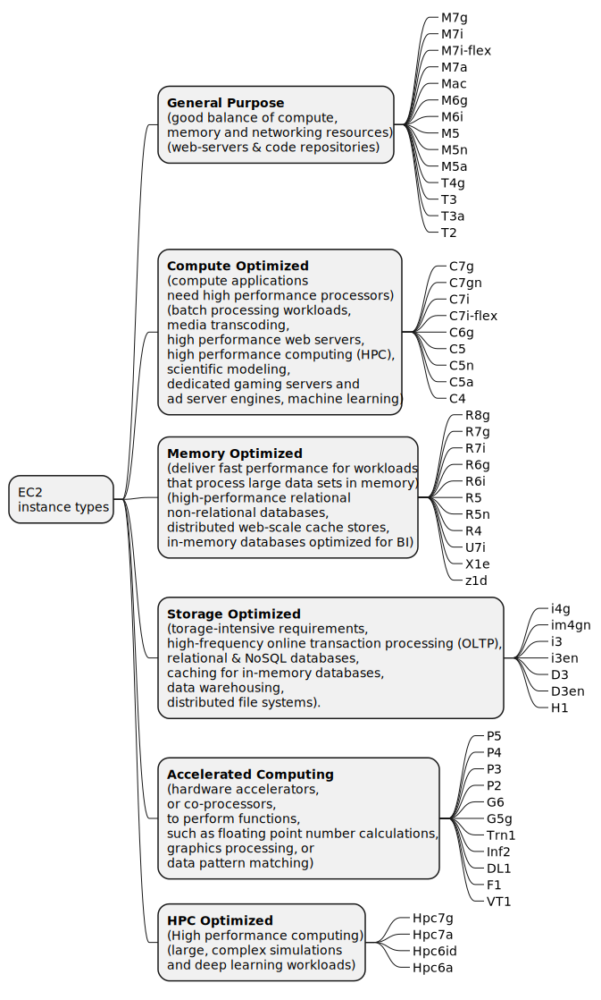
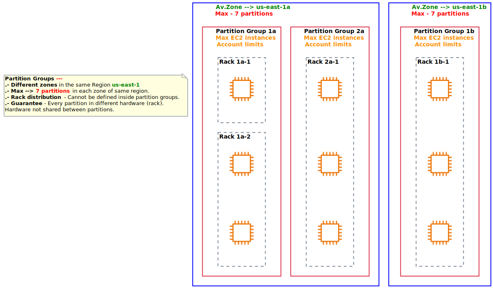
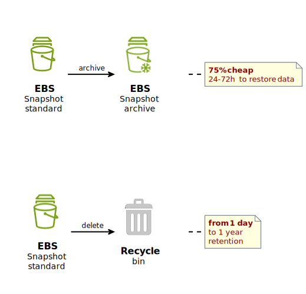

# (EC2) Elastic Compute Cloud

- **Rent Virtual Machines:** EC2 allows users to rent
  virtual machines, known as instances, tailored to specific requirements
  such as compute power, memory and storage.
- **Storing Data:** storage options include Elastic Block Store (EBS) for
  virtual drives and Elastic File System (EFS) for network-attached
  storage. EC2 instances can also leverage Instance Store, offering
  ephemeral storage directly attached to the host machine.
   
   
  
- **Distributing WorkLoad:** Elastic Load Balancer (ELB) facilitates the
  distribution of incoming application traffic across multiple EC2
  instances.
- **Scaling Services:** Auto Scaling Groups (ASG) enable automatic scaling of
  EC2 instances based on predefined criteria. This ensures that
  applications can dynamically adapt to varying workloads, optimizing
  performance and cost efficiency.
   
   
  

## EC2 Sizing & configuration options
- **Operating System (OS):** Linux, Windows or MacOs
- **Compute Power & Cores (CPU):** level of compute
  power and the number of cores to meet application requirements.
- **Random-Access Memory (RAM):** Specify the amount of memory needed
  for optimal performance.
- **Storage Space:** Determine the storage type, including network-attached
  (EBS & EFS) and hardware (EC2 Instance Store) options.
- **Network Configuration:** Configure network-related settings, such as the
  speed of the network card, assignment of public IP addresses. 
- **Firewall rules** through security groups.
- **Bootstrap Script (EC2 User Data):** Use EC2 User Data to automate boot tasks as: 
  - Run scripts at the instance’s first start. This script, executed
    with ***root*** user privileges, can perform actions such as:
    - installing updates,
    - installing software
    - downloading files from the internet.
  - Anything you can think of

## EC2 InstanceTypes - Overview
When we see `m5.2xlarge`\
- ***m***: instance type
- ***5***: Generation (indicating AWS improvements over time)
- ***2xlarge***: Size within the instance class

## CIDR — Classless Inter-Domain Routing
It is a method for efficiently allocating and managing IP addresses in computer networks.
It is crucial to define IP address ranges.
CIDR notation:
- **Base IP address**. Represents a specific IP address within the range. (Examples
  include 10.0.0.0, 192.168.0.0, and so forth.)
- **Subnet Mask**. Defines how many bits of the IP address cannot change, are fixed.

**Example**:
For instance, using the CIDR notation 192.168.0.0/26: This allows for 64 IP
addresses within the range 192.168.0.0 to 192.168.0.63.
The subnet mask /26 signifies that the first 26 bits are fixed, and the
remaining **6** bits can vary, providing $`2^6 = 64`$ possible combinations.

## Security Groups

- Security Group rules can be defined based on either **IP addresses** or **other
  Security Groups**.
- **Security groups only contain allow rules**
- By default, a security group includes an outbound rule that allows all outbound traffic.
 !!! Remove this default rule and add outbound rules that allow specific outbound traffic only !!!.
- All inbound traffic is blocked by default. By default there is NO inbound rules just after the Security Group is created.
- ***General features***:
  - Single Security Group can be attached to multiple instances.
  - Locked down to a region / VPC combination.
  - Security Groups operate independently of the EC2 instances. 
If traffic is blocked by a Security Group, the associated
    EC2 instance remains unaware of the attempted communication.
  - Maintain one separate security group for SSH access.
- ***Firewall Functionality***:
  - Access to specific ports
  - Authorization of IP ranges for both IPv4 and IPv6
  - Control over inbound network traffic
- Control over outbound network traffic
- ***Troubleshooting Tips***
  - Timeout Issues: in case an application becomes inaccessible and times
  out, it is likely attributed to a Security Group misconfiguration.
  - “Connection Refused” Errors: if an application returns a “connection
  refused” error, the problem may lie either with the application itself or its
  launch status rather than the Security Group settings.
- ***Sample***
  - *Security Group 1:* 
    - The 1st inbound rule <code style="color:green">198.51.100.0/24, TCP, 22</code> allows `ssh` traffic from specific IPs `[198.51.100.0 - 198.51.100.255]`  
    - The 2nd inbound rule <code style="color:#cc0066">Subnet A CIDR, All, All</code> allows the instances in **subnet A** to communicate with each other (of **subnet A**) using any protocol and port.
    - The 3rd outbound rule <code style="color:#0066ff">0.0.0.0/0, All, All</code> allows all outbound traffic from any instance in **subnet A**.
  - *Security Group 2:*
    - The 1st inbound rule <code style="color:orange">Subnet B CIDR, All, All</code> allows the instances in **subnet B** to communicate with each other (of **subnet B**) using any protocol and port.
    - The 2nd inbound rule <code style="color:red">Subnet A CIDR, TCP, 22</code> allows the instances in **subnet A** to communicate with the instances in **subnet B** using SSH.
    - The 3rd outbound rule <code style="color:#7F00FF">0.0.0.0/0, All, All</code> allows all outbound traffic from any instance in **subnet B**.

 
## EC2 Instances Purchasing Options

## EC2 Spot Instances lifecycle
Canceling a Spot Instance request and terminating the associated Spot
Instances are distinct actions in AWS.
- _**Cancel.**_ We can cancel Spot Instance request that are **open**, **active** or **disabled** state.
Cancelling a Spot Request does not terminate instances.
- _**Terminate.**_ We must first cancel a Spot Request and then terminate the associated Spot Instances.

## Spot Fleets
- It is a **set** of:
  - Spot Instances
  - (optional) On-Demand Instances
- Spot Fleet will try to meet the **target capacity** with **price** constraints
- Spot Fleets provide the ability to automatically request Spot Instances with
  the lowest price, ensuring cost-effectiveness for the workload.

### Launch pools
- We can define multiple launch pools, so that the fleet can choose.
- Every launch pool can specify different:
  - instance type
  - operating systems
  - AZ.

### Stopping Conditions:
- Spot Fleet stops launching instances when reaching capacity (defined by us) or max cost (defined by us).

### Allocation Strategies:
- **lowestPrice**: from the pool with the lowest price (cost optimization, short workload)
- **diversified**: distributed across all pools (great for availability, long workloads)
- **capacityOptimized**: pool with the optimal capacity for the number of instances
- **priceCapacityOptimized** (recommended): pools with highest capacity available, then select the pool with the lowest price (best choice for most workloads)

## Placement Groups
Placement Strategy: How  EC2 instances are grouped to minimize hardware failure ?

### Cluster
- Same Av.Zone
- Same rack
- **PROs**:
  - Low latency 10 Gbit bandwidth between instances.
- **CONs**:
  - If the AZ fails, all instances fails at the same time
- **Use Case**: real-time analytics or applications with high-performance
  networking requirements.

### Spread
- This is a group of instances that are each (EC2) placed on different rack.
- **_Not_** supported for **Dedicated Instances** or **Dedicated Hosts**.
- PROs:
  - rack failure affects only one instance.
  - Can span (abarcar) across Availability Zones (#AZ AZ) in the same region.
  - Each #EC2 EC2 Instances are on different physical hardware (rack inside the group)
- CONs:
  - Limited to 7 instances per #AZ AZ per placement group
- Use Cases:
  - Application that needs to maximize high availability
  - Critical Applications where each instance must be isolated from failure from each other
  - For example, in a Region with three Availability Zones, we can run a total of 21 instances in the group (seven per zone).

### Partition 
- Up to **7 partitions** per AZ
- Can span (abarcar) across **multiple AZs** in the same region
- Number of EC2 instances (per partition) is limited by Account conditions.
- The instances in a partition do not share racks with the instances in the other partitions. Every partition has their own racks
- Use Cases: HDFS, HBase, Cassandra, Kafka

## EC2 Storage (EBS & EFS)
### Elastic Block Store (EBS)
- It is like a “network USB stick”. Network drive (bit of latency) bounded to a specific availability zone (except for **_io1 / io2_**).
- Persistent storage that survives reboots and instance terminations. Suitable for storing critical data
- It can be detached from an EC2 instance and attached to another one quickly
- Have a provisioned capacity (size in GBs and IOPS)
- **gp2 / gp3(independently configure throughput and IOPS)** (general purpose): IO increases if the disk size increases. Can be boot volume.
  - Virtual desktops, Development and test environments
- **io1 / io2** (IOPS provisioned): can increase IO independently. Can be boot volume. Support multiattach (same EBS attached to multi EC2 in the same AvZone).
  - Critical business applications.
  - Great for databases workloads

- Delete on termination attribute. By default, the root EBS volume is deleted (attribute enabled) but any other is not.
*preserve root volume when instance is terminated*

### EBS snapshots
- Snapshot is an incremental backup, which means that we save only the blocks on the device that have changed since your most recent snapshot.
- Not necessary to detach volume to do snapshots but highly recommended.
- Can copy snapshots across AZs or Regions

- Amazon EBS “Snapshots Archive” is a new storage tier that you can use for low-cost, long-term storage of your rarely-accessed snapshots that do not need frequent or fast retrieval.

### EFS (Elastic File System)

### EC2 storage decision tree

## EC2 Hibernate

## EC2 Networking

## EC2 Autoscaling Groups
