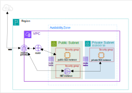
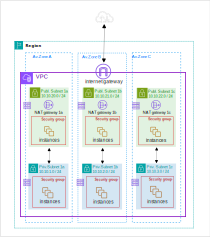
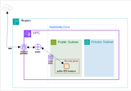

* [Return to table of contents](../../README.md)
# Introduction to Virtual Private Cloud (VPC)
## Pre-knowledge
- [Basic Networking](./000a-basic-networking.md)
- [CIDR — Classless Inter-Domain Routing](./003-ec2.md#34-cidr--classless-inter-domain-routing)

## Introduction
- A VPC is an isolated network space where we can define logical public & private subnets across multiple availability zones in the same region.
  A VPC is a virtual network that closely resembles a traditional network that you'd operate in your own data center.
- VPC provides a logically isolated section of the AWS Cloud where you can define your own virtual network environment.

## By default
- All new AWS accounts have a default VPC.
- The default VPC range falls within the private address space (172.16.0.0/12)
- Default VPC has Internet connectivity and all EC2 instances inside it have public IPv4 addresses.
- Each VPC has a default route table called **the main route table** that provides local routing throughout each VPC.
  It (**the main route table**) is associated with every subnet ([Subnet](#Subnet)) in the VPC, but we can create custom route tables.
- New EC2 instances are launched **_into the default VPC_** if no subnet is specified.
- We also get a public and a private IPv4 DNS names.

## Domain Model
- Each VPC is associated with a **CIDR (classless inter-domain routing) block**, defining its IPv4 address range.
A **VPC can have** a maximum of **5 CIDR (classless inter-domain routing) blocks** associated with it.
The CIDR block size for each VPC should be in the range between:
  - /28 (16 IP addresses) = $`2^{(32 - 28)} = 2^4 = 16`$
  - /16 (65536 IP addresses) = $`2^{(32 - 16)} = 2^16 = 65536`$
- Multiple VPCs can coexist within a single AWS region, with a soft limit of 5 VPCs per region (can be increased).
- It is crucial to ensure that the CIDR (classless inter-domain routing) range of our VPC does not overlap with other networks.
- As VPCs are designed to be private, only specific IPv4 address ranges are allowed. These include:
  - 10.0.0.0 – 10.255.255.255 (10.0.0.0/8) - **_big networks_**
  - 172.16.0.0 – 172.31.255.255 (172.16.0.0/12) --- (16 = *fixed 0001*  0000) --- (31 = *fixed 0001*  1111) - **_default VPC networks_**
  - 192.168.0.0 – 192.168.255.255 (192.168.0.0/16) - **_home networks_**

## Subnet
- A **subnet** is a **range of IP addresses** in your VPC. A subnet must reside in a single **Availability Zone**.
  After you add subnets, you can deploy AWS resources in your VPC.
- Every subnet in a VPC must be associated with a ([Route table](#Route-tables)) which controls the traffic routing for that subnet.
  Multiple subnets can be associated and controlled with a single ([Route table](#Route-tables)) that is assigned to multiple subnets.
- AWS reserves 5 IP addresses (first 4 & last 1) in each subnet. These 5 IP addresses are not available for use and can’t be assigned to an EC2 instance.
if CIDR (classless inter-domain routing) block **_10.0.0.0 / 24_**, then reserved IP addresses are: 
  - **_10.0.0.0_** – Network Address
  - **_10.0.0.1_** – reserved by AWS for the VPC router
  - **_10.0.0.2_** – reserved by AWS for mapping to Amazon-provided DNS
  - **_10.0.0.3_** – reserved by AWS for future use
  - **_10.0.0.255_** – Network Broadcast Address.AWS does not support broadcast in aVPC, therefore the address is reserved
- Sample: if we need 29 IP addresses for EC2 instances:
  - We can’t choose a subnet of size /27 ($`2^{(32 - 27)} = 2^5 = 32`$ IP addresses,$`32 – 5 = 27 < 29`$)
  - We need to choose a subnet of size /26 ($`2^{(32 - 26)} = 2^6 = 64`$ IP addresses,$`64 – 5 = 59 > 29`$)

### Public subnet
- Enabled (EC2) --> Auto-assign public IP address.
- The traffic, in that subnet, can be routed to the Internet Gateway (through default route table rules).

### Private subnet
- Disabled (EC2) --> Auto-assign public IP address.
- The traffic, in that subnet, CANNOT be, directly, routed to the Internet Gateway.

## Internet Gateway
- Allows resources (e.g., EC2 instances) in a VPC to connect to the Internet. Allows communication between instances in your VPC
  and the internet. It serves as a gateway for internet-bound traffic, enabling instances within your VPC to connect to the internet 
  or for the internet to reach your instances. To enable internet access, we must attach an Internet Gateway to our VPC.
- Scales horizontally and it is highly available and redundant.
- Must be created separately from a VPC.
- Internet Gateways, on their own, do not allow Internet access... Route tables must be also edited!
- One VPC can only be attached to one IGW and vice versa
- The only way to access the VPC from:
  - Internet
  - Private VPN connection
  - External locations

  is adding gateway services.

## Route tables
- A Route Table is a set of rules, called routes, that are used to determine where network traffic is directed.
  Every subnet in a VPC must be associated with a route table which controls the traffic routing for that subnet. Each
  route in a table specifies a destination and a target, such as a specific gateway or instance. Use route tables to determine
  where network traffic, from your subnet or gateway, is directed.
- The routes, in a route table, define how traffic is directed. For example, a default route (0.0.0.0/0) might point
  to an Internet Gateway for internet-bound traffic.
- The route table will use the most specific route that matches either IPv4 traffic or IPv6 traffic to determine how to route the traffic.\
  Sample of a **_route table_**:

| Destination     | Target                | Description                                                                                                                                                                                                                                                                                                |
|-----------------|-----------------------|------------------------------------------------------------------------------------------------------------------------------------------------------------------------------------------------------------------------------------------------------------------------------------------------------------|
| 10.0.0.0 / 16   | local                 | When any component (service) **_from inside the subnet_** (where table route is assigned) is demanding to connect to the ip-range (**destination = 10.0.0.0/16**) then is sent through **_target = local_** network.                                                                                       |
| 0.0.0.0 / 0     | igw-12345678901234567 | This is the less specific route. When any component (service) **_from inside the subnet_** (where table route is assigned) is demanding to connect to the ip-range (**destination = 0.0.0.0/0 --> Not 10.0.0.0/16 AND Not 172.31.0.0/16**) then is sent through **_target = IGW_** (AWS internet gateway). |
| 172.31.0.0 / 16 | pcx-11223344556677889 | When any component (service) **_from inside the subnet_** (where table route is assigned) is demanding to connect to the ip-range (**destination = 172.31.0.0/16**) then is sent through **_target = peering connection_**.                                                                                |

- Multiple ([Subnets](#Subnet)) can be associated and controlled with a single route table that is assigned to multiple ([Subnets](#Subnet)).
- Each VPC has a default route table called **_the main route table_**. The **_main route table_** cannot be deleted but it can be
  ignored and it will remain unassigned if we do not associate it with any subnets within the VPC. The **_main route table_** can be modified.
- The main route table also defines the routing for all subnets that are not explicitly associated with any other custom route table

## NAT (Network Address Translation) Instance (Outdated Old component)
- It allows EC2 instances in private subnets to initiate, indirectly, outbound connections to the internet while
  hiding their private IP addresses.
- The NAT Instance must be launched in a public subnet. This ensures
  that it has a route to the internet and can forward traffic from private
  instances to the internet.
- The NAT Instance must have an Elastic IP (EIP) attached to it. An Elastic IP provides a static, 
  public IP address that remains associated with the NAT Instance even if it is stopped and restarted. 
  This is crucial for ensuring consistent outbound connectivity.
- Route Tables associated with private subnets must be configured to route
  outbound traffic to the NAT Instance. This is achieved by adding a route
  with the destination of 0.0.0.0/0 (all traffic) and the target as the NAT
  Instance.
- Internet traffic bandwidth depends on EC2 instance type.
- Not highly available / resilient setup out of the box
  - We need to create an ASG in multi-AZ + resilient user-data script
- We  must manage Security Groups & rules:
  - Inbound:
    - Allow HTTP / HTTPS traffic coming from Private Subnets
    - Allow SSH from your home network (access is provided through Internet Gateway)
  - Outbound:
    - Allow HTTP / HTTPS traffic to the Internet

- | Destination    | Target | Description                                                                                                                                                                                                                                                  |
  |----------------|--------|--------------------------------------------------------------------------------------------------------------------------------------------------------------------------------------------------------------------------------------------------------------|
  | 10.20.0.0 / 16 | local  | When any component (service) **_from inside the subnet_** (where table route is assigned) is demanding to connect to the ip-range (**destination = 10.0.0.0/16**) then is sent through **_target = local_** network.                                         |
  | 0.0.0.0 / 0    | NAT    | This is the less specific route. When any component (service) **_from inside the subnet_** (where table route is assigned) is demanding to connect to the ip-range (**destination = 0.0.0.0/0**) then is sent through **_target = NAT_** (AWS NAT instance). |

## NAT (Network Address Translation) Gateway
- Enables instances in a private subnet to access, indirectly, the Internet without exposing their private IP addresses.
  - AWS-managed.
  - higher bandwidth
  - high availability
  - no administration
- NAT Gateway is resilient within a single Availability Zone. 
- It is created in a specific Availability Zone, uses an Elastic IP.
- We Must create multiple NAT Gateways in multiple AZs for fault-tolerance.
- No Security Groups management is required.
- 5 Gbps of bandwidth with automatic scaling up to 100 Gbps.
- Pay per hour for usage and bandwidth

### Route tables

| Public Subnet    |          |                                                                                                                                                                                                                                                                                                       |
|------------------|----------|------------------------------------------------------------------------------------------------------------------------------------------------------------------------------------------------------------------------------------------------------------------------------------------------------------------|
| Destination      | Target   | Description                                                                                                                                                                                                                                                                                                      |
| 10.10.0.0 / 16   | local    | When any component (service) **_from inside the public subnet_** (where table route is assigned) is demanding to connect to the ip-range (**destination = 10.10.0.0/16**) then is sent through **_target = local_** network.                                                                                     |
| 0.0.0.0 / 0      | IGW      | This is the less specific route. When any component (service) **_from inside the public subnet_** (where table route is assigned) is demanding to connect to the ip-range (**destination = 0.0.0.0/0 --> Not 10.10.0.0/16**) then is sent through **_target = IGW_** (AWS internet gateway). |

| Private Subnet 1a |           |                                                                                                                                                                                                                                                                                                       |
|-------------------|-----------|-------------------------------------------------------------------------------------------------------------------------------------------------------------------------------------------------------------------------------------------------------------------------------------------------------|
| Destination       | Target    | Description                                                                                                                                                                                                                                                                                           |
| 10.10.0.0 / 16    | local     | When any component (service) **_from inside the private subnet 1a_** (where table route is assigned) is demanding to connect to the ip-range (**destination = 10.10.0.0 / 16**) then is sent through **_target = local_** network.                                                                    |
| 0.0.0.0 / 0       | NAT-GW-1a | This is the less specific route. When any component (service) **_from inside the private subnet 1a_** (where table route is assigned) is demanding to connect to the ip-range (**destination = 0.0.0.0 / 0 --> Not 10.10.0.0 / 16**) then is sent through **_target = NAT-GW-1a_** (AWS NAT gateway). |

| Private Subnet 1b |           |                                                                                                                                                                                                                                                                                                       |
|-------------------|-----------|-------------------------------------------------------------------------------------------------------------------------------------------------------------------------------------------------------------------------------------------------------------------------------------------------------|
| Destination       | Target    | Description                                                                                                                                                                                                                                                                                           |
| 10.10.0.0 / 16    | local     | When any component (service) **_from inside the private subnet 1b_** (where table route is assigned) is demanding to connect to the ip-range (**destination = 10.10.0.0 / 16**) then is sent through **_target = local_** network.                                                                    |
| 0.0.0.0 / 0       | NAT-GW-1b | This is the less specific route. When any component (service) **_from inside the private subnet 1b_** (where table route is assigned) is demanding to connect to the ip-range (**destination = 0.0.0.0 / 0 --> Not 10.10.0.0 / 16**) then is sent through **_target = NAT-GW-1b_** (AWS NAT gateway). |

| Private Subnet 1c |           |                                                                                                                                                                                                                                                                                                       |
|-------------------|-----------|-------------------------------------------------------------------------------------------------------------------------------------------------------------------------------------------------------------------------------------------------------------------------------------------------------|
| Destination       | Target    | Description                                                                                                                                                                                                                                                                                           |
| 10.10.0.0 / 16    | local     | When any component (service) **_from inside the private subnet 1c_** (where table route is assigned) is demanding to connect to the ip-range (**destination = 10.10.0.0 / 16**) then is sent through **_target = local_** network.                                                                    |
| 0.0.0.0 / 0       | NAT-GW-1c | This is the less specific route. When any component (service) **_from inside the private subnet 1c_** (where table route is assigned) is demanding to connect to the ip-range (**destination = 0.0.0.0 / 0 --> Not 10.10.0.0 / 16**) then is sent through **_target = NAT-GW-1c_** (AWS NAT gateway). |

## Comparing NAT Gateway & NAT Instance
|                      | NAT Gateway                                       | NAT Instance                                      |
|----------------------|---------------------------------------------------|---------------------------------------------------|
| Availability         | Highly available within AZ (create in another AZ) | Use a script to manage failover between instances |
| Bandwidth            | Up to 100 Gbps                                    | Depends on EC2 instance type                      |
| Maintenance          | Managed by AWS                                    | Managed by ours (e.g., software, OS patches, ...) |
| Cost                 | Per hour & amount of data transferred.            | Per hour, EC2 instance type and size, + network $ |
| Public IPv4          | YES                                               | YES                                               |
| Private IPv4         | YES                                               | YES                                               |
| Security Groups      | Not needed                                        | Needed                                            |
| Use as Bastion Host? | No                                                | Yes                                               |

## Bastion hosts

## Considerations
- The private subnets are accessible from:
  - Internet
  - private VPN connection
  - from external network location\

  because we have:
    - Gateway Services 
    - Route Tables

  defined in the VPC. 

## Summary
- To enable internet access for the instances (EC2) included in the public subnet(s), we must:
  - Create an Internet Gateway. 
  - Attach an Internet Gateway to our VPC.
  - Create a custom route table or modify the main route table for our subnet(s).
  - Add a route to the Internet Gateway (0.0.0.0/0) in the route table,
    directing internet-bound traffic to the Internet Gateway.
  - Associate the route table with the subnet(s) that need internet access.

- NAT Gateway is a fully managed service by AWS, providing:
  - higher bandwidth 
  - high availability
  - no administration required.
  - simplified administration for outbound
    internet connectivity from private subnets. 

  It is designed to be scalable and removes the operational overhead
  associated with managing NAT Instances.

