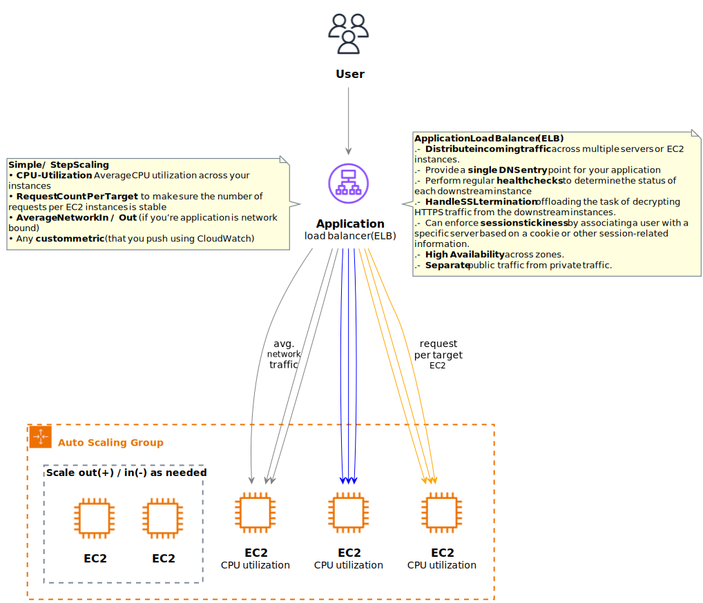

* [Return to table of contents](../../README.md)
# Pre-knowledge
## Health checks
- Health checks are used to monitor the status of targets in a load balancer’s target group. 
Requests for online availability status are sent to registered targets at a configured interval 
to verify that registered targets are available to serve traffic. If a target fails a health check, 
it is removed from the target group and will not receive traffic until it is deemed healthy again.
- They enable the load balancer to know if instances (it forwards traffic to) are available to reply any requests:
  - The health check is done on a port and a route (/health is common). 
  - If the response is not 200 (OK), then the instance is unhealthy.

# Load Balancer
## General knowledge
- Load balancers optimize:
  - the performance
  - the availability
  - the security 

  of your applications by:
  - distributing traffic.
  - managing failures.
  - providing centralized access points.

- **_General Features_**:
  - **Spread load across multiple downstream instances**: distribute incoming
    traffic across multiple servers or EC2 instances. This ensures that no
    single server is overwhelmed and improves the overall performance and
    responsiveness of your application.
  - **Expose a single point of access (DNS) to your application**: load balancers
    provide a single DNS entry point for your application. This simplifies the
    access for users and clients, abstracting the complexity of managing
    multiple server addresses.
  - **Do regular health checks to your instances**: perform regular health
    checks to determine the status of each downstream instance. If an
    instance is found to be unhealthy, the load balancer can take it out of
    rotation, preventing it from receiving traffic until it is healthy again.
  - **Provide SSL Termination (HTTPS) for your websites**: load balancers can
    handle SSL termination, offloading the task of decrypting HTTPS traffic
    from the downstream instances. This helps in reducing the
    computational load on the instances, improving overall performance.
  - **Enforce stickiness with cookies**: can enforce session stickiness by
    associating a user with a specific server based on a cookie or other
    session-related information. This ensures that subsequent requests from
    the same user are directed to the same backend server, maintaining
    session state.
  - **High Availability across zones**: load balancers can be configured to
    operate across multiple Availability Zones (AZs). This enhances the high
    availability of your application by distributing traffic across
    geographically separated data centers.
  - **Separate public traffic from private traffic**: load balancers can be used to
    separate public-facing traffic from private or internal traffic. This helps
    in securing and managing different types of communication within your
    architecture.

# Elastic Load Balancer (ELB)
## Introduction (ELB)
- Elastic Load Balancer (ELB) is a **fully managed load balancing service** provided by AWS.
It distributes incoming application or network traffic across multiple targets (EC2 instances),
in multiple Availability Zones (AZs).
- Amazon Elastic Load Balancer (Amazon ELB) is a load balancing service that distributes incoming 
application traffic across Amazon EC2 instances, Amazon ECS containers, AWS Lambda functions & IP addresses.
- ELB helps to ensure that your application is highly available and scalable by distributing incoming
traffic across multiple resources.
- _**ELB key features**_:
  - **High Availability**: ELB is designed for high availability by distributing
    traffic across multiple Availability Zones. If one zone becomes
    unavailable, traffic is automatically routed to healthy instances in other
    zones.
  - **Automatic scaling**: ELB integrates with Auto Scaling Groups, allowing
    you to automatically scale the number of instances based on demand. It
    dynamically adjusts the number of instances behind the load balancer to
    handle changes in traffic.
      
  

     
  - **Health checks**: ELB regularly performs health checks on registered
    instances and routes traffic only to healthy instances. If an instance is
    unhealthy, ELB will automatically stop sending traffic to that instance
    until it passes the health check again.
      

      
  - **ELB supports SSL termination**, allowing it to handle HTTPS traffic. It
    also integrates with AWS Certificate Manager for easy management of
    SSL/TLS certificates. Network Load Balancer additionally provides source
    IP preservation, enabling applications that rely on the IP address of the
    client.
  - **ELB integrates with AWS CloudWatch**, providing metrics and logs to
    monitor the performance and health of the load balancer. This includes
    information on request rates, latency, and error rates.

## Types of Load Balancer
### Application Load Balancer (ALB)
- it operates at the **_application_** layer that it is the 7th layer of the OSI (Open Systems Interconnection) model.
- ALB supports:
  - routing to multiple applications on the same machine, making it well-
    suited for containerized applications where multiple services run on a
    single host.
  - Redirects, which can be useful for scenarios like redirecting HTTP traffic
    to HTTPS for improved security.
  - Flexible routing based on various factors, including path in the URL,
    hostname in the URL, query string parameters, and headers. This
    enables you to route traffic to different target groups based on specific
    conditions.
  - Has a port mapping feature to redirect to a dynamic port in ECS. Integrates 
    seamlessly with Amazon ECS (Elastic Container Service), offering a port mapping 
    feature that allows dynamic port redirection within ECS.

#### Architecture tip
- To give external & internal users access to a private application (located in private subnet).
  - If we stop the public side, the internal side is not affected.
  - We don't mix Public & Private traffic. Better for security reasons.
  - Save money because internal accesses are not spending money regarding internet traffic.

### Network Load Balancer (NLB)

### Gateway Load Balancer (GLB)

### Classic Load Balancer (CLB)