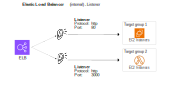
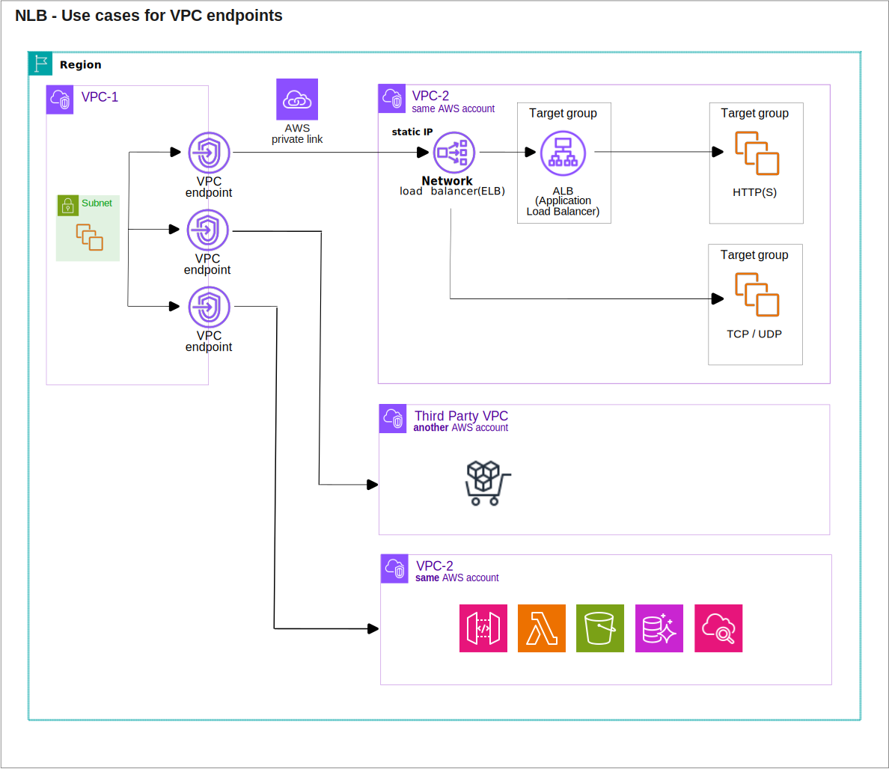

* [Return to table of contents](../../README.md)
# Pre-knowledge
## Health check
- Health check are used to monitor the status of targets in a load balancer’s target group. 
Requests for online availability status are sent to registered targets at a configured interval 
to verify that registered targets are available to serve traffic. If a target fails a health check, 
it is removed from the target group and will not receive traffic until it is deemed healthy again.
- They enable the load balancer to know if instances (it forwards traffic to) are available to reply any requests:
  - The health check is done on a port and a route (/health is common). 
  - If the response is not 200 (OK), then the instance is unhealthy.

## Introduction SSL-TLS
- Load balancers on AWS use `X.509` certificates for SSL/TLS encryption. These
  certificates are essential for securing the communication between clients
  and the load balancer. An `SSL Certificate` allows traffic between our clients and our load balancer
  to be encrypted in transit (in-flight encryption).

## Sticky sessions
- Use case: make sure the user doesn’t lose his session data.
- Sticky sessions are used to ensure that a user's session is always directed to the same backend server.
  Allow a load balancer to direct a user’s requests consistently to the same backend instance, based on
  some identifier.
- Enabling sticky sessions may introduce imbalance in the load distribution
  across backend EC2 instances: since the same user is always directed to the
  same instance, some instances might receive more traffic than others,
  potentially leading to uneven utilization of resources.
- Sticky Session works for Classic Load Balancer (CLB), Application Load Balancer (ALB) & 
  Network Load Balancer (NLB).
- For both **CLB** & **ALB**, the “cookie” used for stickiness has an expiration date that we control

### With sticky sessions

### Without sticky sessions

### Cookie Names

- _Application-based Cookies_
  - Custom cookie
    - Generated by the target
    - Can include any custom attributes required by the application
    - Cookie name must be specified individually for each target group
    - Don’t use **_AWSALB_**, **_AWSALBAPP_**, or **_AWSALBTG_** (reserved for use by the ELB)
  - _Application cookie_
    - Cookie generated by the load balancer based on information from the application. 
      It allows the load balancer to direct requests from clients back to the correct target (sticky session).
    - Generated by the load balancer 
    - Cookie name is **_AWSALBAPP_**
- _Duration-based Cookies_
  - These cookies are used for maintaining **_session stickiness_** over a **specified duration**.
  - Cookie generated by the load balancer
  - Cookie name is:
    - **_AWSALB_** for ALB
    - **_AWSELB_** for CLB

## Target group
- Target group is a set (group) of one or more registered destinations (services) that receive traffic.

# Load Balancer
## General knowledge
- Load balancers optimize:
  - the performance
  - the availability
  - the security 

  of your applications by:
  - distributing traffic.
  - managing failures.
  - providing centralized access points.

- **_General Features_**:
  - **Spread load across multiple downstream instances**: distribute incoming
    traffic across multiple servers or EC2 instances. This ensures that no
    single server is overwhelmed and improves the overall performance and
    responsiveness of your application.
  - **Expose a single point of access (DNS) to your application**: load balancers
    provide a single DNS entry point for your application. This simplifies the
    access for users and clients, abstracting the complexity of managing
    multiple server addresses.
  - **Do regular health checks to your instances**: perform regular health
    checks to determine the status of each downstream instance. If an
    instance is found to be unhealthy, the load balancer can take it out of
    rotation, preventing it from receiving traffic until it is healthy again.
  - **Provide SSL Termination (HTTPS) for your websites**:
    load balancers can handle SSL termination, offloading the task of decrypting HTTPS traffic
    from the downstream instances. This helps in reducing the
    computational load on the instances, improving overall performance.
  - **Enforce stickiness with cookies**:  can enforce session stickiness by
    associating a user with a specific server based on a cookie or other
    session-related information. This ensures that subsequent requests from
    the same user are directed to the same backend server, maintaining
    session state. [Sticky Session](#sticky-sessions)
  - **High Availability across zones**: load balancers can be configured to
    operate across multiple Availability Zones (AZs). This enhances the high
    availability of your application by distributing traffic across
    geographically separated data centers.
  - **Separate public traffic from private traffic**: load balancers can be used to
    separate public-facing traffic from private or internal traffic. This helps
    in securing and managing different types of communication within your
    architecture.

# Elastic Load Balancer (ELB)
## Introduction (ELB)
- Elastic Load Balancer (ELB) is a **fully managed load balancing service** provided by AWS.
It distributes incoming application or network traffic across multiple targets (EC2 instances),
in multiple Availability Zones (AZs).
- Amazon Elastic Load Balancer (Amazon ELB) is a load balancing service that distributes incoming 
application traffic across Amazon EC2 instances, Amazon ECS containers, AWS Lambda functions & IP addresses.
- ELB helps to ensure that your application is highly available and scalable by distributing incoming
traffic across multiple resources.
- _**ELB key features**_:
  - **High Availability**: ELB is designed for high availability by distributing
    traffic across multiple Availability Zones. If one zone becomes
    unavailable, traffic is automatically routed to healthy instances in other
    zones.
  - **Automatic scaling**: ELB integrates with Auto Scaling Groups, allowing
    you to automatically scale the number of instances based on demand. It
    dynamically adjusts the number of instances behind the load balancer to
    handle changes in traffic.
      
  

     
  - **Health checks**: ELB regularly performs health checks on registered
    instances and routes traffic only to healthy instances. If an instance is
    unhealthy, ELB will automatically stop sending traffic to that instance
    until it passes the health check again.
      

      
  - **ELB supports SSL termination**, allowing it to handle HTTPS traffic. It
    also integrates with AWS Certificate Manager for easy management of
    SSL/TLS certificates. Network Load Balancer additionally provides source
    IP preservation, enabling applications that rely on the IP address of the
    client.
  - **ELB integrates with AWS CloudWatch**, providing metrics and logs to
    monitor the performance and health of the load balancer. This includes
    information on request rates, latency, and error rates.

## SSL-TLS
- We can use ACM (AWS Certificate Manager) to provision, manage, and deploy SSL/TLS certificates for
  your load balancers. Alternatively, we have the option to upload our own
  SSL/TLS certificates if they are not managed through ACM; this provides
  flexibility for using certificates obtained from other sources.
- | **ELB** | **Number of SSL/TLS certificates** | **SNI (Server Name Indication)**                                       |
  |---------|------------------------------------|------------------------------------------------------------------------|
  | CLB     | 1                                  | No (must use `N` CLBs for `N` hostnames with `N` SSL/TLS certificates) |
  | ALB     | 1 .. 25                            | Yes                                                                    |
  | NLB     | 1 .. 25                            | Yes                                                                    |
- When configuring an HTTPS listener on a load balancer:
  - we must specify a default certificate. This certificate is used when the client does not support
    Server Name Indication (SNI) or when the SNI request does not match any of
    the specified certificates.
  - Clients can use SNI to specify the hostname they are trying to reach.
  - SNI allows multiple SSL/TLS certificates (to support multiple domains) to be associated with a single IP address,
    enabling the load balancer to determine the correct certificate to present based on
    the requested hostname.
  - Ability to specify a security policy to support older versions of SSL /TLS (legacy clients)

### Server Name Indication (SNI)
- Server Name Indication (SNI) enables the load balancer to determine the correct certificate to present based on the requested hostname.
- It is a mechanism that allows a load balancer to identify the correct certificate to use based on the requested hostname.
- Application load balancers support hosting multiple certificates per ALB, enabling multiple websites 
  with separate domains to be hosted by a single ALB. Up to 25 certificates can be attached per ALB. 
  SNI enables the assignment of the correct SSL/TLS certificate 
  to the associated server. The ALB sends the website’s or domain’s public key to the end user to establish 
  a secure connection with the load balancer.

## **Listener**
- It is a process that checks (listen) for connection requests, using the protocol and port that you configure.
- Each listener has a rule based on which an action is taken based on a request.

| **Listener (protocol & port)** | **Rule**                           | **Action**                                         |
|--------------------------------|------------------------------------|----------------------------------------------------|
| http / 80                      | Check if `User-Agent` is Mozilla   | Forward To.                                        |
| http / 80                      | Check if `Host` Header is demo.com | Redirect to.                                       |
| http / 80                      | Check if path is `/videos`         | Fixed response. `200` & `Content-Type: Text/plain` |

## Cross Zone Load Balancing
- it may increase data transfer costs between
  instances in different AZs (Network Load Balancer - NLB).
- Enabled by default in Application Load Balancer (ALB)
- Disabled by default in Network Load Balancer (NLB)

| **ELB** | **Cross Zone enabled by default**           | **Charges inter AZ data** |
|---------|---------------------------------------------|---------------------------|
| ALB     | Yes (can be disabled at Target Group level) | No                        |
| CLB     | No                                          | No                        |
| NLB     | No                                          | Yes                       |

### Enabled

### Disabled

## Connection Draining
- It is a feature provided by AWS ELBs that ensures in-flight requests are
  completed before instances are taken out of service.
- When an instance is marked as unhealthy or is being removed from an Auto Scaling group,
  Connection Draining helps to handle the existing connections to that instance gracefully.
- Connection Draining works in coordination with health checks: if an instance fails a health check
  or is otherwise marked as unhealthy. Connection Draining allows existing connections
  to be completed before the instance is fully removed from the load balancer.
- Time to complete “in-flight requests” (active) while the instance is de-registering or unhealthy.
  You can configure a timeout period for Connection Draining, specifying the maximum time the load balancer should allow in-flight requests to continue
  on an instance marked for removal. The time must be Between 1 & 3600 seconds (default: 300 seconds).
  - Can be disabled (set value to 0)
  - Set to a low value if your requests are short
- During this period new requests are not sent to the instance marked as unhealthy.
  The load balancer stops sending new requests to the EC2 instance which is de-registering.
- It is particularly useful in scenarios such as rolling deployments, where instances are
  replaced with new versions. It is also valuable in conjunction with Auto
  Scaling groups, as instances can be added or removed dynamically based on
  the demand.

## Types of Load Balancer
### Application Load Balancer (ALB)
- it operates at the **_application_** layer that it is the 7th layer (application) of the OSI (Open Systems Interconnection) model.

- it provides fixed hostname **_XXX.region.elb.amazonaws.com_**
- When ordering an Application Load Balancer, we must choose:
  - **_IF_** the load balancer 
    accepts **_public inbound traffic (Internet-facing)_** or **_private inbound traffic (internal)_**
  - The **_Availability Zones / Subnets_** where the ALB will operate. Remember that we assign Av.Zones to EC2 instances 
    when we set the **_Subnet_** in the EC2 definition. Remember that each **_subnet_** is defined in a **_single availability zone_**, 
- **Health checks** are at the **target group level**
- Cross-zone load balancing is enabled by default. No charges for inter AZ data traffic.
- ALB uses either **_round-robin_** or a **_least-available-request_** algorithm for target- ing registered EC2 instances.
- The target service don't see the IP of the requester.
  - The true IP of the client is inserted in the header **_X-Forwarded-For_**
  - We can also get Port (**_X-Forwarded-Port_**) and the protocol (_**X-Forwarded-Proto**_)
- ALB supports:
  - Load balancing to multiple HTTP applications across machines (target groups).
  - routing to multiple applications on the same machine, making it well-
    suited for containerized applications where multiple services run on a
    single host.
  - Flexible routing based on various factors, including:
    - path in the URL.
    - hostname in the URL.
    - query string parameters.
    - headers ( **_host-header_**, **_HTTP-header_** ).
    
    This enables you to route traffic to different target groups based on specific conditions.
  - Redirects, which can be useful for scenarios like redirecting HTTP traffic
    to HTTPS for improved security.
  - Has a port mapping feature to redirect to a dynamic port in ECS. Integrates 
    seamlessly with Amazon ECS (Elastic Container Service), offering a port mapping 
    feature that allows dynamic port redirection within ECS.
  - Server Name Indication (SNI) enables you to secure multiple websites using a
    single secure listener.
  - IPv4 and IPv6 for **_Internet-facing_** load balancers; for internal load balancers, it supports only IPv4.
  - Amazon Cognito integration to provide end-user authentication.
  - [TLS / SSL Termination](#provide-ssl-termination)

#### **Application Load Balancer Security Group**
  - Allow HTTP / HTTPS traffic coming from anywhere.
#### **Service Security Group**
  - Allow traffic only from the application load balancer.

#### **Architecture tip**
- To give external & internal users access to a private application (located in private subnet).
  - If we stop the public side, the internal side is not affected.
  - We don't mix Public & Private traffic. Better for security reasons.
  - Save money because internal accesses are not spending money regarding internet traffic.

### Network Load Balancer (NLB)
- Network Load Balancer provides TCP and UDP load balancing at the 4th layer (transport) of the OSI (Open Systems Interconnection) model.

- Forward TCP & UDP traffic to your instances.

- Cross-zone load balancing is disabled by default. We pay charges for inter AZ data traffic (if enabled).
- NLB uses a flow-based algorithm to distribute traffic to the targets in a target group. This means it distributes
  traffic based on the number of connections rather than on the amount of data transferred.
- NLB can scale to handle millions of requests per second at very low latencies (~ 100ms).
- For use cases such as gaming applications, financial systems.

#### Target groups

#### NLB features:
  - Health Checks support the TCP, HTTP and HTTPS Protocols.
  - Server Name Indication (SNI): Serves multiple websites using a single TLS listener.
  - TLS offloading: Client TLS session termination is supported, allowing TLS termination tasks to be carried out by the load balancer.
    [TLS / SSL Termination](#provide-ssl-termination)
  - [Sticky Sessions](#sticky-sessions) can be defined per target session.
  - **_Preserve client-side source IP address_**: Backend servers can see the IP address of the client.
  - **_Static IP address_**: NLB provides one static IP address per AZ. ALB does not. So we can use it when we require a static IP for our LB.
  - **_EIP support:_** It is the only ELB that supports EIP. An Elastic IP address can be assigned for each AZ. This is useful for scenarios where whitelisting specific IP addresses is required
  - **_DNS fail-over_**: If there are no healthy targets available, Route 53 directs traffic to load balancer nodes in other AZs.
  - **_Route 53 integration_**: Route 53 can route traffic to an alternate NLB in another AWS region.
  - **_Zonal isolation_**: The NLB can be enabled in a single AZ, supporting applications that require zonal isolation.
#### NLB supports:
  - Load balancing applications hosted at AWS & on premises using IPv4/IPv6 addresses.
  - Connections across **peered VPCs** in **different AWS regions**.
  - Long-running connections, which are ideal for **_WebSocket_** applications.
  - Failover across AWS regions, using **Route 53** health checks.
  - Preserving the source IP addresses of the clients that are connecting.
  - “end-to-end security” with TLS termination performed by the NLB. [TLS / SSL Termination](#provide-ssl-termination)
#### NLB is good when
  - We need Layer 4 type of requests when using TCP / UDP ports or for non-HTTP protocols. For example, 
    if you have many applications & they are defined with ports.
  - We need low latency.
  - We need a fixed IP (static IP) of the LB to use it with 3rd party DNS management tool to use it 
    for A records where the ALB IP addresses change and can't be used for A records. 
  - We need to preserve the client’s source IP address.

#### Use cases
- Imagine a massively multiplayer online game that requires low-latency connections for real-time gameplay. 
The gaming company uses NLB to distribute incoming player connections across a fleet of game servers. NLB’s ability 
to handle millions of concurrent TCP connections with low latency ensures smooth gameplay for users worldwide
- Streaming Services: For managing video and audio streaming services with huge traffic volumes.
- _**AWS PrivateLink**_ is a highly available, scalable technology that we can use to privately **_connect our VPC_** 
  to services **_as if they were in our VPC_**. 
  We do not need to use an internet gateway, NAT device, public IP address, AWS Direct Connect connection, or AWS Site-to-Site VPN connection 
  to allow communication with the service from our private subnets. Therefore, we control the specific API endpoints, sites, and services that are reachable from our VPC.
  - On the left has several EC2 instances in a private subnet and three interface VPC endpoints
  - The top-most VPC endpoint connects to a service hosted by another AWS account. With one static IP per Availability Zone on NLB, you get full control over your IP addresses.
    -  This enables various use cases as follows:
       - Allow-listing of IP addresses for firewall rules.
       - Pointing a DNS Zone apex to an application fronted by an ALB. Utilizing ALB as a target of NLB, a DNS A-record type can be used to resolve your zone apex to the NLB static IP addresses.
       - When legacy clients cannot utilize DNS resulting in a need for hard-coded IP addresses. 
  - The middle VPC endpoint connects to an AWS Marketplace partner service.
  - The bottom VPC endpoint connects to a service hosted in a different VPC in the same AWS account.

### Gateway Load Balancer (GLB)

### Classic Load Balancer (CLB)