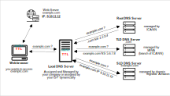

* [Return to table of contents](../../README.md)
# DNS
## Glossary
- **_Domain Registrar_**  
  A domain registrar is a company accredited to register and manage domain names.
  They act as an intermediary between us and the registries that control 
  top-level domains (TLDs) like .com, .org, and .net. When we want a domain name, 
  we go through a registrar. They handle the registration process, allow us 
  to manage our domain's settings (like DNS records), and ensure 
  our domain remains active as long as you renew it
  Samples are: Amazon Route 53, GoDaddy, ...
- **_Zone file_**: A zone file is a text file that contains the DNS records for a domain; the
  records are hosted on DNS servers and are essential for the proper
  functioning of the DNS system, enabling the translation of human-readable
  domain names into IP addresses.
- **_DNS record_**: DNS records are the individual entries in the zone file. Each record contains specific information about a domain.
  DNS records provide the necessary mapping between domain names and the underlying infrastructure, enabling us to easily access websites and online services.
  It is a piece of information stored in the DNS system that maps domain names (like example.com) 
  to specific resources or services, such as IP addresses or email servers. These records guide web traffic and other communications to the right destination on the internet. 
  The DNS records are stored in authoritative DNS servers and are queried whenever someone tries to access a domain. 
- **_Name Server_**: resolves DNS queries (Authoritative or Non-Authoritative)
- _**Top Level Domain (TLD)**_: .com, .us, .in, .gov, .org, ...
- **_Second Level Domain (SLD)_**: amazon.com, google.com, ...

## Introduction

- Domain Name System (DNS) is a decentralized system that translates
  human-readable domain names (like www.example.com) into IP addresses.
- The anatomy of domain name: **_tenant.api.leadmgm.com_**. 
  DNS uses hierarchical naming structure:\
  ```
  .com 
  example.com 
  www.example.com
  api.example.com
  ```


- The RFC explains the anatomy as a syntax [RFC-1034](https://datatracker.ietf.org/doc/html/rfc1034#section-3.5)


- A **_zone file_** is a **_text file_** that contains the DNS records for a domain; the
records are hosted on DNS servers and are essential for the proper
functioning of the DNS system, enabling the translation of human-readable
domain names into IP addresses:

### A record
  - **_A_** Record (Address Record): maps a domain or subdomain to an IPv4
  address. \
  `google.com. 300 IN A 142.250.150.102`
    - **_google.com._** represents the domain name.
    - **_300_** indicates the Time to Live (TTL) value, or the time (in seconds) 
    a system can cache this record before needing to refresh it from the DNS server.
    - **_IN_** means the class, which is almost invariably “IN” for internet in this context.
    - **_A_** specifies the type of the DNS record – an address record, in this case.
    - **_142.250.150.102_** is the data element (IPv4) – the actual IP address to which the domain name points.

### AAAA record
  - **_AAAA_** Record (IPv6 Address Record): similar to A record but for IPv6
  addresses. It is the same than `A` records but with IPv6. \
  `example.com.   86400   IN  AAAA  2001:0db8:85a3:0000:0000:8a2e:0370:7334`

### CNAME record
  - **_CNAME_** (Canonical Name Records): alias of one domain to another (used for
  subdomains or pointing a domain to another domain).
  This record works as an alias and maps one name to another. It’s often used 
  to reduce duplication in domain name configurations. 
  It also simplifies the maintenance of multiple records connected 
  to the same IP address. It’s one of the common mechanisms that’s been adopted 
  by cloud services to provision customer-specific services.
  if we run this command line: \
  bash  --> `dig +noall +answer CNAME blog.mozilla.com`, then we obtain: \
  `blog.mozilla.com.         60        IN        CNAME   mozilla.wpengine.com.` \
  it means:
    - `blog.mozilla.com.` is the new hostname or alias
    - `60` is the TTL (time to live)
    - `IN` is the class
    - `CNAME` is the type
    - `mozilla.wpengine.com.` is the existing one commonly called target.
  - **_Example_**: Shoes & More is an online store that sells a wide variety of footwear 
  products and accessories to customers globally. They have experienced 
  significant growth, resulting in high website traffic and the need to optimize 
  their website’s performance and loading speed. The company decided to integrate 
  a CDN to enhance its website’s performance. To achieve this, they signed up 
  for a CND service and they were advised to set up a CNAME record.
  `www.shoesandmore.com.    IN    CNAME    cdn.examplecdn.com.`

  - `www.shoesandmore.com.`: The NEW hostname being mapped (ensure the trailing dot is included for full qualification).
  - IN: Denotes the record class, typically IN (Internet).
  - CNAME: Specifies that this is a CNAME record.
  - `cdn.examplecdn.com.`: The (current existing) target domain provided by the CDN service (replace with the actual CDN-provided domain).

### NS record
  - **_NS_** (Name Server): specifies authoritative DNS servers for the domain.

### MX record
  - **_MX_** (Mail Exchange): points to mail servers responsible for receiving
  email on behalf of the domain.
  - Sample: \
  `google.com.		74	IN	MX	10 smtp.google.com.`\
  `google.com.      202 IN  MX  20 alt1.aspmx.l.google.com.`
  
  - `10, 20` are the priority levels.  Lower number belongs to higher priority. It means 
  the highest priority must be for `smtp.google.com.`
  - `smtp.google.com.` is the mail server.
  - `74, 202` is the TTL (Time To Live). The time (in seconds)
    a system can cache this record before needing to refresh it from the DNS server. 

### TXT record
  - **_TXT_** (Text Record): holds text information, often used for domain
  verification or to provide information to external sources.

### SOA record
  - **_SOA_** (Start of Authority): contains information about the domain & the
  DNS server responsible for the domain. Provides essential parameters for the zone, 
  including primary name server and administrator email address.

## How works
