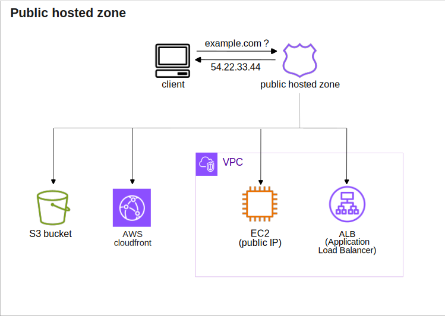
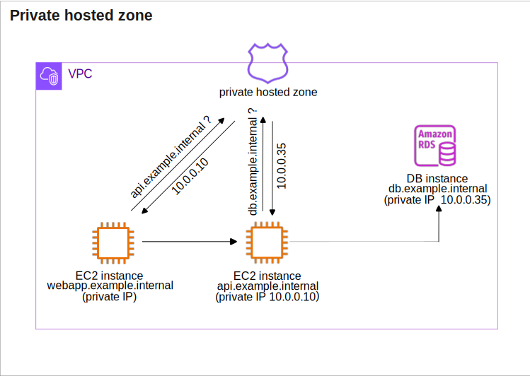
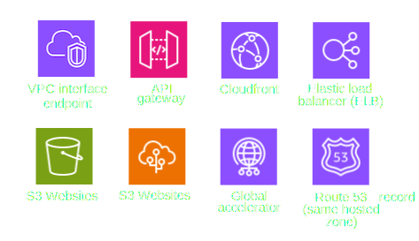
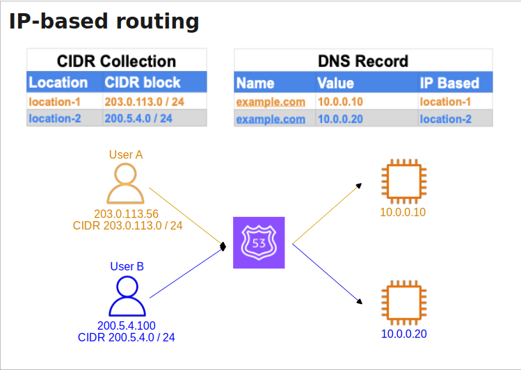
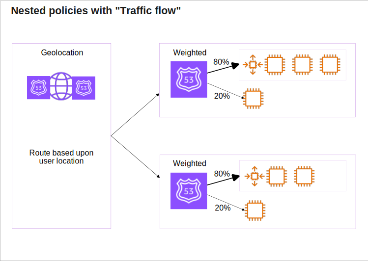

* [Return to table of contents](../../README.md)
# Route 53
## Introduction
- Amazon Route 53 is a comprehensive and fully-managed DNS web service
  provided by AWS; **_it is an authoritative DNS service, meaning that users have
  full control over updating and managing their DNS records_** (this includes
  configurations for A records, CNAME records, MX records, and more).
- A highly available, scalable, fully
  managed and Authoritative DNS 
  - Authoritative = the customer (we) can update the DNS records.
  - Route 53 is also a Domain Registrar.
  - Ability to **_check the health_** of your resources
  - The only AWS service which provides 100% availability SLA
  - it distributes DNS
    queries across multiple locations globally, ensuring low-latency responses
    and high availability

## Route 53 Services
- **_Domain name registration_**. We use Route 53 to register the domain name 
  for your website or application. After you choose a domain name and it is verified,
  the domain name is registered with Route 53. Route 53 DNS records can also be linked 
  to an existing domain. When a domain has been registered with Route 53,
  Route 53 becomes the DNS service for the domain and creates a hosted zone for the domain.
- **_DNS resolution_**.  Route 53 routes Internet traffic to the resources for our domain:
  - Public-facing resources. A [public hosted zone](#public-hosted-zone) is required for public-facing resources such as a company website.
  - Private-facing resources. [Private hosted zones](#private-hosted-zone) are created to route traffic within a VPC.
- **_Health checks_**: Automated health checks can be delivered on a persistent schedule 
  to cloud services and resources to confirm they are still available and functioning (working). 
  When resources become unavailable, Route 53 routes requests from unhealthy resources to healthy resources.
  - **The health of resources**: Health checks can monitor selected endpoints based on their DNS name, 
    IP address, or domain name to verify whether resources are reachable and functioning.
    Humble Bundle Pearson Networking and Security Certification Bundle – © Pearson. Do Not Distribute.
    350 AWS Certified Solutions Architect – Associate (SAA-C03) Cert Guide
  - **The status of other health checks**: Health checks can monitor multiple regional workloads to ensure 
    that healthy resources are available across AWS regions or resources located on other public clouds or on premises.
  - **The status of CloudWatch alarms**: Route 53 can monitor the same metrics being monitored by CloudWatch 
    and make decisions without needing to communicate directly with the CloudWatch service.

## Records
- Route 53 supports the following DNS record types:
  - (must know)A /AAAA / CNAME / [NS](006-DNS-Introduction.md#ns-record)
  - (advanced)CAA / DS / MX / NAPTR / PTR / [SOA](006-DNS-Introduction.md#soa-record) / TXT / SPF / SRV

- Each record contains:
  - Domain / subdomain Name – e.g., example.com
  - Record Type – e.g., A or AAAA
  - Value – e.g., 12.34.56.78
  - Routing Policy – how Route 53 responds to queries
  - [TTL](#ttl-time-to-live) – amount of time the record is cached at DNS Resolvers

## Hosted zone
- A hosted zone is similar to a traditional [DNS zone file](006-DNS-Introduction.md#zone-file). It represents a container to collect DNS records 
  that can be managed together ,belonging to a single parent domain name. All the DNS record sets 
  within a hosted zone share the same parent domain name. It means that all the DNS records within a 
  hosted zone share the same parent domain name. It means that all the DNS records within a
  hosted zone must have the hosted zone's domain name as a suffix. 
- Each hosted zone has two records: 
  - A name server ([**NS**](006-DNS-Introduction.md#ns-record)) record 
  - The start of authority ([**SOA**](006-DNS-Introduction.md#soa-record)) record.
- We pay $0.50 per month per hosted zone.

### Public hosted zone
- Contains DNS records involving public domain names & public-facing resources such as a company website.
  These are domain names that are accessible and resolvable globally on the public Internet.

### Private hosted zone
- Contains DNS records involving private domain names & resources within one or more VPCs.
  These domain names are not accessible from the public Internet and are used
  for internal communication within an organization’s network.

## TTL (time to live)
- The Time-to-Live ([TTL](#ttl-time-to-live)) value in DNS records plays a crucial role in how DNS
caching and record updates are handled. The choice of [TTL](#ttl-time-to-live) depends on the
specific requirements and trade-offs between reducing traffic, minimizing
outdated records, and the need for quick updates.
- **_High [TTL](#ttl-time-to-live)_** – e.g., 24 hr
  - Less traffic on Route 53 and lower costs.
  - Possibly outdated records (slow propagation) when changes are made to DNS records. 
- **_Low [TTL](#ttl-time-to-live)_** – e.g., 60 sec.
  - More traffic on Route 53 ($$) and increased costs.
  - Records are outdated for less time ensuring that changes to DNS records are
    propagated quickly.
  - Easy to change records.
- Except for [Alias](#alias-records) records, TTL is mandatory for each DNS record

## Alias records
- Maps a hostname (domain or subdomain) to an AWS
  resource, such as an Elastic Load Balancer (ELB), CloudFront distribution, or an
  S3 bucket extending the traditional DNS functionality by allowing seamless
  mapping to AWS resources without the need for manual updates.
- Automatically recognizes changes in the AWS resource’s IP addresses
- Unlike CNAME, **Alias** works for both root and non-root domains. 
  It can be used for the top node (top level domain) of a DNS namespace (Zone Apex), 
  e.g.: example.com
- **Alias Record** is always of type A / AAAA for AWS resources (IPv4 / IPv6)
- We cannot set the [TTL](#ttl-time-to-live).
- Provides native health checks.
- Free of charge.
- **Alias records** cannot be directly used for EC2 instances DNS names.
- Targets:
  - ELB
  - CloudFront
  - S3 Websites
  - Amazon API Gateway
  - Elastic Beanstalk
  - VPC interface endpoints
  - Global Accelerator
  - Route 53 record.

  

## Routing policies
- When Route 53 receives a query, a routing policy determines the response.

### Simple
- Simple DNS response providing the IP address associated with a name. Due is simple (one IP or value) 
  it cannot be associated (no sense) with Health Checks.
- When Alias enabled, specify only one AWS resource.
- If multiple values are returned, a random one is chosen by the client.
- Use case: A single resource, such as a web server, that is serving content for a single domain.

| **Name**           | **Type** | **Value** | **TTL** |
|--------------------|----------|-----------|---------|
| simple.axample.com | A        | 10.0.0.10 | 60      |
|                    |          | 10.0.0.11 |         |
|                    |          | 10.0.0.12 |         |

### Weighted
- Control the % of the requests that go to each specific resource.
- This is used to route traffic to multiple resource properties as defined by us 
  (for example, we want to say 80% traffic to site A and 20% to site B
- Use Case: For routing traffic to multiple resources at defined traffic levels.
  Load balancing between regions, testing new application versions...

| **Name**           | **Type**                           | **Value** | **Health** | **Weight** |
|--------------------|------------------------------------|-----------|------------|------------|
| simple.axample.com | A                                  | 10.0.0.10 | ID         | 60         |
| simple.axample.com | A                                  | 10.0.0.20 | ID         | 20         |
| simple.axample.com | A                                  | 10.0.0.30 | ID         | 20         |

### Failover
- If the primary resource is not responding, the request is sent to the secondary location.

| **Name**           | **Type**                           | **Value** | **Health** |           |
|--------------------|------------------------------------|-----------|------------|-----------|
| simple.axample.com | A                                  | 10.0.0.10 | ID         | primary   |
| simple.axample.com | A                                  | alb-id    |            | secondary |

### Latency based
- This optimizes the best latency for the resources deployed in multiple AWS Regions.
  Redirect to the resource that has the least latency close to us.

| **Name**           | **Type**                           | **Value** | **Health** | **Region**     |
|--------------------|------------------------------------|-----------|------------|----------------|
| simple.axample.com | A                                  | 10.0.0.10 | ID         | ap-southeast-1 |
| simple.axample.com | A                                  | 10.0.0.20 | ID         | us-east-1      |
| simple.axample.com | A                                  | alb-id    | ID         | ap-southeast-2 |

### Geolocation
- This routing is based on user location.
- Use case: For routing traffic based on the physical location of the end user.
  Website localization, restrict content distribution, load balancing, ...

| **Name**           | **Type**                           | **Value** | **Health** | **Geo-location** |
|--------------------|------------------------------------|-----------|------------|------------------|
| simple.axample.com | A                                  | 10.0.0.10 | ID         | Singapore        |
| simple.axample.com | A                                  | 10.0.0.20 | ID         | Default          |
| simple.axample.com | A                                  | alb-id    | ID         | Oceania          |

### Multi-Value Answer
- This is used to respond to DNS queries with up to eight healthy, randomly selected records.
  It allows us to specify multiple IP addresses for a resource.
- Using multiple IP addresses with health checks, Route 53 will return records for healthy resources 
  that respond successfully to health checks.
- Use case: For responding with up to eight healthy address records

| **Name**           | **Type**                           | **Value** | **Health** | **Multi-value** |
|--------------------|------------------------------------|-----------|------------|-----------------|
| simple.axample.com | A                                  | 10.0.0.10 | ID         | Yes             |
| simple.axample.com | A                                  | 10.0.0.20 | ID         | Yes             |
| simple.axample.com | A                                  | 10.0.0.30 | ID         | Yes             |

### Geoproximity (using Route 53 Traffic Flow feature)
- Route traffic to our resource based on the geographic locations of our users and 
  requested resources. This routing requires us to create a defined Route 53 traffic policy.
- Use case: For routing traffic based on the location of our AWS resources

### IP-Based routing
- Routing is based on clients’ IP addresses.
- We provide a list of CIDRs for our clients and the corresponding resource-ip/endpoints/locations
  (user-CIDR-to-resourceIP mappings)
- Use cases: Optimize performance, reduce network costs, route end users from a particular ISP to a specific endpoint.

## Health checks

### Monitor an Endpoint
### Calculated Health Checks
### Private Hosted Zones

## Route 53 traffic flow
- You can build advanced routing policies by nesting these (explained) primary routing policies into traffic policies; 
  the following diagram shows a nested policy architecture defined using the tool called "Traffic flow".

