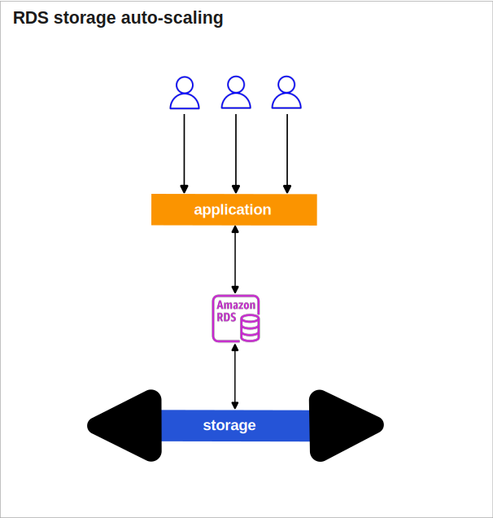
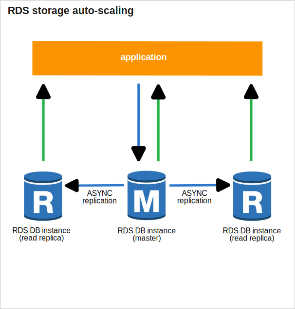
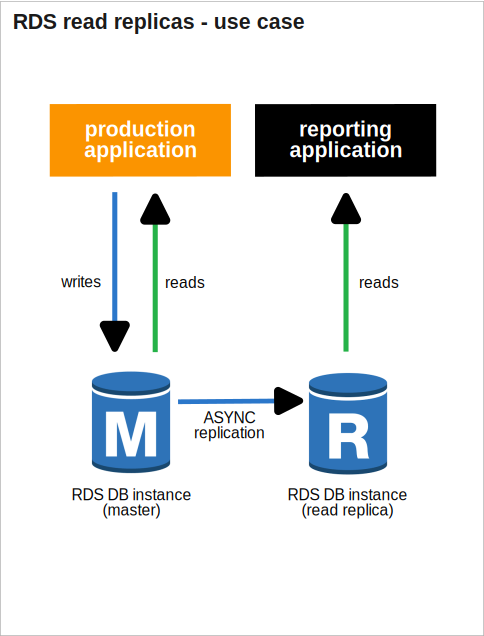
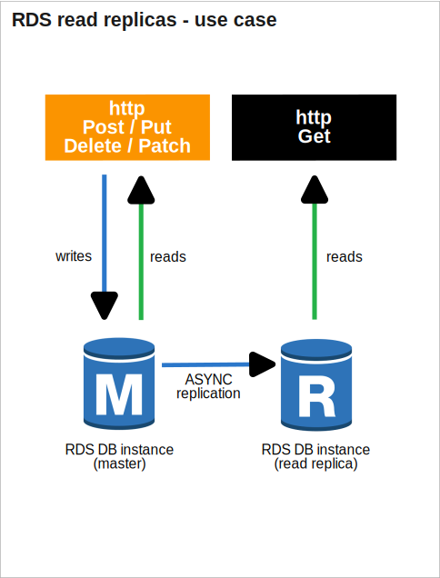
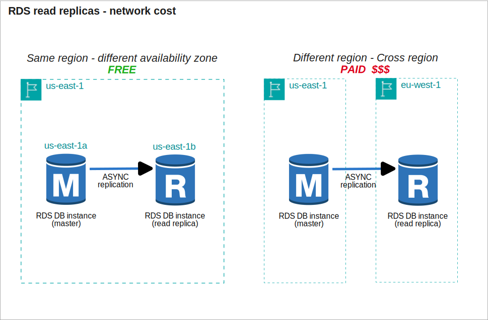
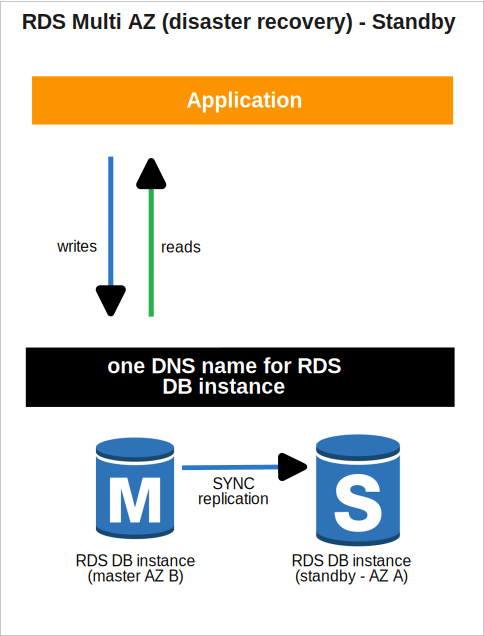
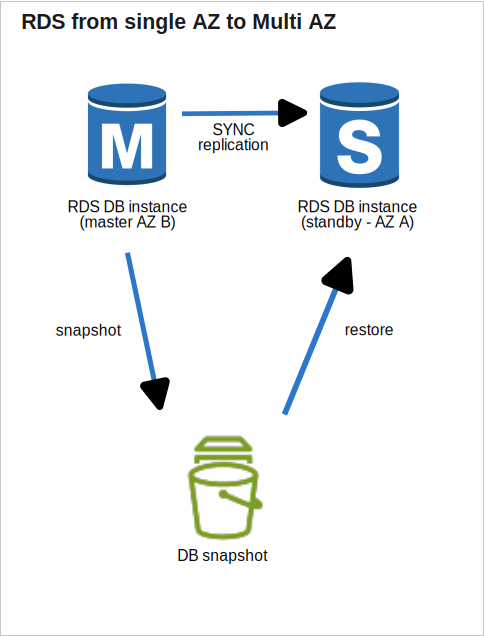
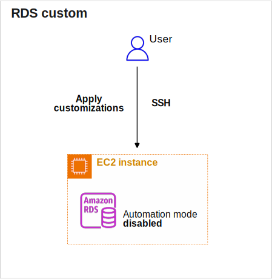

* [Return to table of contents](../../README.md)
# RDS (Relational Database Service)
## Amazon RDS Introduction
- It’s a managed DB service for DBs that use SQL as a query language.
  It allows us to create databases in the cloud that are managed by AWS
  - Postgres (RLS - Row Level Security)
    - RLS is a security mechanism that controls access to rows in a table based on the user's criteria.  It allows fine-grained control over data visibility.
      Good option to manage multi-tenancy (pool model) DBs.
    ```
      CREATE POLICY order_access ON orders
      USING (customer_id = current_customer_id());
    ```
  - MySQL
  - MariaDB
  - Oracle
  - Microsoft SQL Server
  - IBM DB2
  - Aurora (AWS Proprietary database)

## RDS versus deploying DB on EC2
- RDS is a managed service:
  - Automated provisioning, OS patching
  - Continuous backups and restore to specific timestamp (Point in Time Restore)
  - Snapshots: manual, can make copies of snapshots cross region
  - Monitoring dashboards
  - Launched within a VPC, usually in private subnet, control network access using security groups (important when using Lambda)
  - Read replicas for improved read performance
  - Multi AZ setup for DR (Disaster Recovery)
  - Maintenance windows for upgrades
  - Scaling capability (vertical and horizontal) 
  - Storage backed by EBS
  - RDS Events: get notified via SNS for events (operations, outages...)
- BUT we cannot SSH into our instances that allocates the DB server.

## RDS – Storage Auto Scaling
- Helps us increase storage on our RDS DB instance dynamically
- When RDS detects we are running out of free database storage, it scales automatically
- Avoid manually scaling our database storage
- We have to set Maximum Storage Threshold (maximum limit for DB storage)
- Automatically modify storage if:
  - Free storage is less than 10% of allocated storage.
  - Low-storage lasts at least 5 minutes, We are in storage under limits for at least 5 minutes.
  - 6 hours have passed since last modification
- Useful for applications with unpredictable workloads
- Supports all RDS database engines



## RDS Read Replicas
### For read scalability
- Up to 15 Read Replicas
- Within AZ, Cross AZ or Cross Region
- Replication is ASYNC, so reads are eventually consistent
- Replicas can be promoted to their own DB
- Applications must update the connection string to leverage read replicas



### Use cases
- Use Case 1
  - We have a production database that is taking on normal load
  - We want to run a reporting application to run some analytics
  - We create a Read Replica to run the new workload there
  - The production application is unaffected
  - Read replicas are used for SELECT (=read) only kind of statements (not INSERT, UPDATE, DELETE)
 

   

- Typical scenario of CQRS
  - We have microservice exposing GET requests connecting to DB-Read-Replica
  - We have microservice exposing POST / PUT / DELETE requests connecting to DB-Master instance


   

### Network cost
- In principle, In AWS there’s a network cost when any data goes from one AZ to another 
- But For RDS Read Replicas within the same region, we don’t pay that fee


  

## RDS Backups
- Automated backups:
  - Daily full backup of the database (during the backup window)
  - Transaction logs are backed-up by RDS every 5 minutes
  - => ability to restore to any point in time (from oldest backup to 5 minutes ago) 
  - 1 to 35 days of retention, set 0 to disable automated backups
- Manual DB Snapshots
  - Manually triggered by the user
  - Retention of backup for as long as you want
- Trick: in a stopped RDS database, you will still pay for storage. If you plan on stopping it for a long time, you should snapshot & restore instead

## RDS Restore options
- Restoring a RDS backup or a snapshot creates a new database.
- Restoring MySQL RDS database from S3 
  - Create a backup of your on-premises database
  - Store it on Amazon S3 (object storage)
  - Restore the backup file onto a new RDS instance running MySQL

## RDS Multi AZ (Disaster Recovery)
- When we **_enable_** the _**Multi-AZ**_ option in Amazon RDS, AWS automatically provisions 
  a **_standby database instance_** in a different availability zone (AZ) from the primary instance (master).
  This **_standby instance_** is not active for read or write operations but is synchronized with 
  the primary instance (master) to ensure the data is up to date.
- The replication between the primary instance (master) and the standby instance is **_Synchronous_**.
- Automatic failover (commutation) in case of loss of AZ, loss of network, instance or storage failure.
  No manual intervention is needed in backend apps.
- The standby instance is not used for auto-scaling.


  


## RDS From Single-AZ to Multi-AZ
- Zero downtime operation (no need to stop the DB)
- Just click on “modify” for the database
- The following happens internally:
  - A snapshot is taken
  - A new DB is restored from the snapshot in a new AZ
  - Synchronization is established between the two databases




## RDS Custom
- Managed Oracle and Microsoft SQL Server Database with OS and database customization
- RDS: Automates setup, operation, and scaling of database in AWS
- Custom: access to the underlying database and OS so we can 
  - Configure settings
  - Install patches
  - Enable native features
  - Access the underlying EC2 Instance using SSH or SSM Session Manager
  - De-activate Automation Mode to perform your customization, better to take a DB snapshot before
- RDS vs. RDS Custom
  - RDS: entire database and the OS to be managed by AWS
  - RDS Custom: full admin access to the underlying OS and the database



## RDS Security
- At-rest encryption:
  - Database master & replicas encryption using AWS KMS – must be defined as launch time 
  - If the master is not encrypted, the read replicas cannot be encrypted
  - To encrypt an un-encrypted database, go through a DB snapshot & restore as encrypted
- In-flight encryption: TLS-ready by default, use the AWS TLS root certificates client-side
- IAM Authentication: IAM roles to connect to your database (instead of username/pw) 
- Security Groups: Control Network access to your RDS DB.
- No SSH available except on RDS Custom
- Audit Logs can be enabled and sent to CloudWatch Logs for longer retention

## RDS Proxy


# Amazon Aurora
## Introduction
## High Availability and Read Scaling
## DB Cluster
## Features
## Replicas - Auto Scaling
## Custom Endpoints
## Serverless
## Global Aurora
## Machine Learning
## Backups
- Automated backups
  - 1 to 35 days (cannot be disabled)
  - point-in-time recovery in that timeframe
- Manual DB Snapshots
  - Manually triggered by the user
  - Retention of backup for as long as you want

## Aurora Restore options
- Restoring an Aurora backup or a snapshot creates a new database.
- Restoring MySQL Aurora cluster from S3
  - Create a backup of your on-premises database using Percona XtraBackup
  - Store the backup file on Amazon S3
  - Restore the backup file onto a new Aurora cluster running MySQL

## Database Cloning
## Aurora Security
- At-rest encryption:
    - Database master & replicas encryption using AWS KMS – must be defined as launch time
    - If the master is not encrypted, the read replicas cannot be encrypted
    - To encrypt an un-encrypted database, go through a DB snapshot & restore as encrypted
- In-flight encryption: TLS-ready by default, use the AWS TLS root certificates client-side
- IAM Authentication: IAM roles to connect to your database (instead of username/pw)
- Security Groups: Control Network access to your Aurora DB
- Audit Logs can be enabled and sent to CloudWatch Logs for longer retention

# Amazon ElastiCache
## Introduction
## Solution Architecture
### DB Cache
### User Session Store
## Redis vs Memcached
## Cache Security
## Patterns
## Redis Use Case

