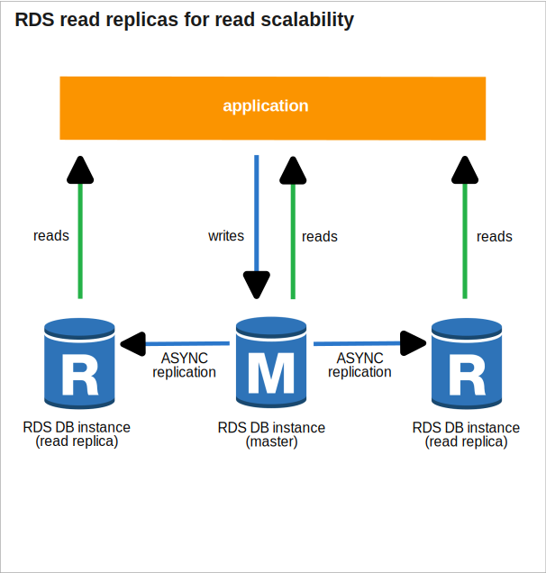

* [Return to table of contents](../../README.md)
# RDS (Relational Database Service)
## Amazon RDS Introduction
- It’s a managed DB service for DBs that use SQL as a query language.
  It allows us to create databases in the cloud that are managed by AWS
  - Postgres (RLS - Row Level Security)
    - RLS is a security mechanism that controls access to rows in a table based on the user's criteria.  It allows fine-grained control over data visibility.
      Good option to manage multi-tenancy (pool model) DBs.
    ```
      CREATE POLICY order_access ON orders
      USING (customer_id = current_customer_id());
    ```
  - MySQL
  - MariaDB
  - Oracle
  - Microsoft SQL Server
  - IBM DB2
  - Aurora (AWS Proprietary database)

## RDS versus deploying DB on EC2
- RDS is a managed service:
  - Automated provisioning, OS patching
  - Continuous backups and restore to specific timestamp (Point in Time Restore)
  - Snapshots: manual, can make copies of snapshots cross region
  - Monitoring dashboards
  - Launched within a VPC, usually in private subnet, control network access using security groups (important when using Lambda)
  - Read replicas for improved read performance
  - Multi AZ setup for DR (Disaster Recovery)
  - Maintenance windows for upgrades
  - Scaling capability (vertical and horizontal) 
  - Storage backed by EBS
  - RDS Events: get notified via SNS for events (operations, outages...)
- BUT we cannot SSH into our instances that allocates the DB server.

## RDS – Storage Auto Scaling
- Helps us increase storage on our RDS DB instance dynamically
- When RDS detects we are running out of free database storage, it scales automatically
- Avoid manually scaling our database storage
- We have to set Maximum Storage Threshold (maximum limit for DB storage)
- Automatically modify storage if:
  - Free storage is less than 10% of allocated storage.
  - Low-storage lasts at least 5 minutes, We are in storage under limits for at least 5 minutes.
  - 6 hours have passed since last modification
- Useful for applications with unpredictable workloads
- Supports all RDS database engines


## RDS Read Replicas
### For read scalability
- Up to 15 Read Replicas
- Within AZ, Cross AZ or Cross Region
- Replication is ASYNC, so reads are eventually consistent
- Replicas can be promoted to their own DB
- Applications must update the connection string to leverage read replicas



### Use cases
- Use Case 1
  - We have a production database that is taking on normal load
  - We want to run a reporting application to run some analytics
  - We create a Read Replica to run the new workload there
  - The production application is unaffected
  - Read replicas are used for SELECT (=read) only kind of statements (not INSERT, UPDATE, DELETE)
 

   

- Typical scenario of CQRS
  - We have microservice exposing GET requests connecting to DB-Read-Replica
  - We have microservice exposing POST / PUT / DELETE requests connecting to DB-Master instance


   

### Network cost
- In principle, In AWS there’s a network cost when any data goes from one AZ to another 
- But For RDS Read Replicas within the same region, we don’t pay that fee


  

## RDS Backups
- Automated backups:
  - Daily full backup of the database (during the backup window)
  - Transaction logs are backed-up by RDS every 5 minutes
  - => ability to restore to any point in time (from oldest backup to 5 minutes ago) 
  - 1 to 35 days of retention, set 0 to disable automated backups
- Manual DB Snapshots
  - Manually triggered by the user
  - Retention of backup for as long as you want
- Trick: in a stopped RDS database, you will still pay for storage. If you plan on stopping it for a long time, you should snapshot & restore instead


## RDS Restore options
- Restoring a RDS backup or a snapshot creates a new database.
- Restoring MySQL RDS database from S3 
  - Create a backup of your on-premises database
  - Store it on Amazon S3 (object storage)
  - Restore the backup file onto a new RDS instance running MySQL


## RDS Multi AZ (Disaster Recovery)
- When we **_enable_** the _**Multi-AZ**_ option in Amazon RDS, AWS automatically provisions 
  a **_standby database instance_** in a different availability zone (AZ) from the primary instance (master).
  This **_standby instance_** is not active for read or write operations but is synchronized with 
  the primary instance (master) to ensure the data is up to date.
- The replication between the primary instance (master) and the standby instance is **_Synchronous_**.
- Automatic failover (commutation) in case of loss of AZ, loss of network, instance or storage failure.
  No manual intervention is needed in backend apps.
- The standby instance is not used for auto-scaling.


  


## RDS From Single-AZ to Multi-AZ
- Zero downtime operation (no need to stop the DB)
- Just click on “modify” for the database
- The following happens internally:
  - A snapshot is taken
  - A new DB is restored from the snapshot in a new AZ
  - Synchronization is established between the two databases


## RDS Custom
- Managed Oracle and Microsoft SQL Server Database with OS and database customization
- RDS: Automates setup, operation, and scaling of database in AWS
- Custom: access to the underlying database and OS so we can 
  - Configure settings
  - Install patches
  - Enable native features
  - Access the underlying EC2 Instance using SSH or SSM Session Manager
  - De-activate Automation Mode to perform your customization, better to take a DB snapshot before
- RDS vs. RDS Custom
  - RDS: entire database and the OS to be managed by AWS
  - RDS Custom: full admin access to the underlying OS and the database


## RDS Security
- At-rest encryption:
  - Database master & replicas encryption using AWS KMS – must be defined as launch time 
  - If the master is not encrypted, the read replicas cannot be encrypted
  - To encrypt an un-encrypted database, go through a DB snapshot & restore as encrypted
- In-flight encryption: TLS-ready by default, use the AWS TLS root certificates client-side
- IAM Authentication: IAM roles to connect to your database (instead of username/pw) 
- Security Groups: Control Network access to your RDS DB.
- No SSH available except on RDS Custom
- Audit Logs can be enabled and sent to CloudWatch Logs for longer retention

## RDS Proxy (rds & aurora connection pool)
- Fully managed database proxy for RDS
- Allows apps to pool and share DB connections established with the database. When using Lambda functions with RDS, it (the lambda) opens and maintains a database connection.
  This can result in a “**_TooManyConnections_**” exception
- With RDS Proxy, you no longer need code that handles cleaning up idle connections and managing connection pools.
  Improving database efficiency by reducing the stress on database resources (e.g., CPU, RAM) and minimize open connections (and timeouts)
- Serverless, autoscaling, highly available (multi-AZ)
- Reduced **_RDS & Aurora failover_** time by up 66%
- Supports **_RDS (MySQL, PostgreSQL, MariaDB, MS SQL Server) and Aurora (MySQL, PostgreSQL)_**
- No code changes required for most apps
- Enforce IAM Authentication for DB, and securely store credentials in AWS Secrets Manager
- RDS Proxy is never publicly accessible (must be accessed from VPC)
- The Lambda function must have connectivity to the Proxy:
  - public proxy => public Lambda 
  - private proxy => Lambda in VPC
- This is similar to **_Hikari connection Pool_** in **_Spring Boot Framework_**.
  - Efficient Resource Management: Manages database connections efficiently, reusing them instead of creating new ones for every query.
  - High Performance: It's lightweight and optimized for speed, offering better performance compared to other connection pool libraries.
  - Low Latency: Designed for low-latency applications by minimizing overhead.
  - Reliable and Stable: It includes robust health checks, leak detection, and failure recovery mechanisms.


## RDS Cross Region Failover
- Cross region failover is not supported (by default) for RDS
- Same strategy can be used for Aurora as well. To replicate between two different AWS Regions we can use Global Aurora Database.


# Amazon Aurora
## Introduction
- Aurora is a proprietary technology from AWS (not open sourced)
- Postgres (RLS is supported natively) and MySQL are both supported as Aurora DB (that means your drivers will work as if Aurora was a Postgres or MySQL database)
- Aurora is “AWS cloud optimized” and claims 5x performance improvement over MySQL on RDS, over 3x the performance of Postgres on RDS
- Aurora storage automatically grows in increments of 10GB, up to 128 TB.
- Aurora can have up to 15 replicas and the replication process is faster than
MySQL (sub 10 ms replica lag)
- Failover (commutation) in Aurora is instantaneous. It’s HA (High Availability) native.
- Aurora costs more than RDS (20% more) – but is more efficient

## Features
- Automatic failover (commutation) to an Aurora Replica in case the primary DB instance becomes unavailable.
- Backup and Recovery
- Isolation and security
- Industry compliance
- Push-button scaling
- Automated Patching with Zero Downtime
- Advanced Monitoring
- Routine Maintenance
- Backtrack: restore data at any point of time without using backups

## High Availability and Read Scaling
- 6 copies of our data across 3 AZ:
  - 4 copies out of 6 needed for writes. Reads only require three out of six nodes to be available
  - 3 copies out of 6 need for reads. Writes require four out of six nodes to be available.
  - Self healing (recovery, rehabilitation, recuperation, cure) with peer-to-peer replication 
  - Storage is striped (distributed, partitioned, split, segmented) across 100s of volumes.
  - One Aurora Instance takes writes (master)
- Automated failover for master in less than 30 seconds
- Master + up to 15 Aurora Read Replicas serve reads
- Support for Cross Region Replication


## DB Cluster


## Replicas - Auto Scaling


## Aurora Endpoints
- Endpoint = Host Address + Port
- Cluster Endpoint (Writer Endpoint)
  - Connects to the current primaryDB instance in the Aurorac luster
  - Used for all write operations in the DB cluster (inserts,updates,deletes and queries)
- Reader Endpoint
  - Provides load-balancing for read-only connections to all Aurora Replicas in the Aurora cluster 
  - Used only for read operations (queries)
- Custom Endpoint
  - Represents a set on DB instances that you choose in the Aurora cluster
  - Used when you want to connect to different subsets of DB instances with different capacities and configurations (e.g., different DB parameter group)
- Instance Endpoint
  - Connects to aspecific DB instance in the Aurora cluster
  - Used when you want to diagnosis and fine tune a specific DB instance

## Custom Endpoints
- Define a subset of Aurora Instances as a Custom Endpoint
- Example: Run analytical queries on specific replicas
- The Reader Endpoint is generally not used after defining Custom Endpoints


## Serverless
- Automated database instantiation and auto- scaling based on actual usage
- Good for infrequent, intermittent or unpredictable workloads
- No capacity planning needed
- Pay per second, can be more cost-effective


## Global Aurora
- Aurora Cross Region Read Replicas: 
  - Useful for disaster recovery
  - Simple to put in place
- Aurora Global Database (recommended):
  - 1 Primary Region (read / write)
  - Up to 5 secondary (read-only) regions, replication lag is less than 1 second
  - Up to 16 Read Replicas per secondary region
  - Helps for decreasing latency
  - Promoting another region (for disaster recovery) has an RTO (recovery time objective) of < 1 minute
  - Typical cross-region replication takes less than 1 second


## Machine Learning
- Enables you to add ML-based predictions to your applications via SQL
- Simple, optimized, and secure integration between Aurora and AWS ML services
- Supported services
  - Amazon SageMaker (use with any ML model) 
  - Amazon Comprehend (for sentiment analysis)
- You don’t need to have ML experience
- Use cases: fraud detection, ads targeting, sentiment analysis, product recommendations


## Aurora backups
- Automated backups
  - 1 to 35 days (cannot be disabled)
  - point-in-time recovery in that timeframe
- Manual DB Snapshots
  - Manually triggered by the user
  - Retention of backup for as long as you want


## Aurora Restore options
- Restoring an Aurora backup or a snapshot creates a new database.
- Restoring MySQL Aurora cluster from S3. Steps:
  - Create a backup of your on-premises database using Percona XtraBackup
  - Store the backup file on Amazon S3
  - Restore the backup file onto a new Aurora cluster running MySQL


## Aurora Database Cloning
- Create a new Aurora DB Cluster from an existing one
- Faster than snapshot & restore
- Uses copy-on-write protocol
  - Initially, the new DB cluster uses the same data volume as the original DB cluster (fast and efficient – no copying is needed)
  - When updates are made to the new DB cluster data, then additional storage is allocated and data is copied to be separated
- Very fast & cost-effective
- Useful to create a “staging” database from a “production” database without impacting the production database


## Aurora Security
- At-rest encryption:
    - Database master & replicas encryption using AWS KMS – must be defined as launch time
    - If the master is not encrypted, the read replicas cannot be encrypted
    - To encrypt an un-encrypted database, go through a DB snapshot & restore as encrypted
- In-flight encryption: TLS-ready by default, use the AWS TLS root certificates client-side
- IAM Authentication: IAM roles to connect to your database (instead of username/pw)
- Security Groups: Control Network access to your Aurora DB
- Audit Logs can be enabled and sent to CloudWatch Logs for longer retention

# Amazon ElastiCache
## Introduction
- The same way RDS is to get managed Relational Databases...
- ElastiCache is to get managed Redis or Memcached
- Caches are in-memory databases with really high performance, low latency
- Helps reduce load off of databases for read intensive workloads
- Helps make your application stateless
- AWS takes care of OS maintenance / patching, optimizations, setup, configuration, monitoring, failure recovery and backups
- Using ElastiCache involves heavy application code changes

## Solution Architecture
### DB Cache
- Applications queries ElastiCache, if not available, get from RDS and store in ElastiCache.
- Helps relieve load in RDS
- Cache must have an invalidation strategy to make sure only the most current data is used in there.


### User Session Store
- User logs into any of the application
- The application writes the session data into ElastiCache
- The user hits another instance of our application
- The instance retrieves the data and the user is already logged in

## Redis vs Memcached

| **Redis**                                                      | **Memcached**                                    |
|----------------------------------------------------------------|--------------------------------------------------|
| • Multi AZ with Auto-Failover                                  | • Multi-node for partitioning of data (sharding) |
| • Read Replicas to scale</br> reads and have high availability | • No high availability (replication)             |
| • Data Durability using AOF persistence                        | • Non persistent                                 |
| • Backup and restore features                                  | • Backup and restore (Serverless)                |
| • Supports Sets and Sorted Sets                                | • Multi-threaded architectur                     |


## Cache Security
- ElastiCache supports IAM Authentication for Redis
- IAM policies on ElastiCache are only used for AWS API-level security
- Redis AUTH
  - You can set a “password/token” when you create a Redis cluster
  - This is an extra level of security for your cache (on top of security groups)
  - Support SSL in flight encryption
- Memcached
  - Supports SASL-based authentication (advanced)


## Patterns
- Lazy Loading: all the read data is cached, data can become stale in cache
- Write Through: Adds or update data in the cache when written to a DB (no stale data)
- Session Store: store temporary session data in a cache (using TTL features)
- Quote:There are only two hard things in Computer Science: cache invalidation and naming things


## Redis Use Case
- Gaming Leaderboards are computationally complex
- Redis Sorted sets guarantee both uniqueness and element ordering
- Each time a new element added, it’s ranked in real time, then added in correct order


