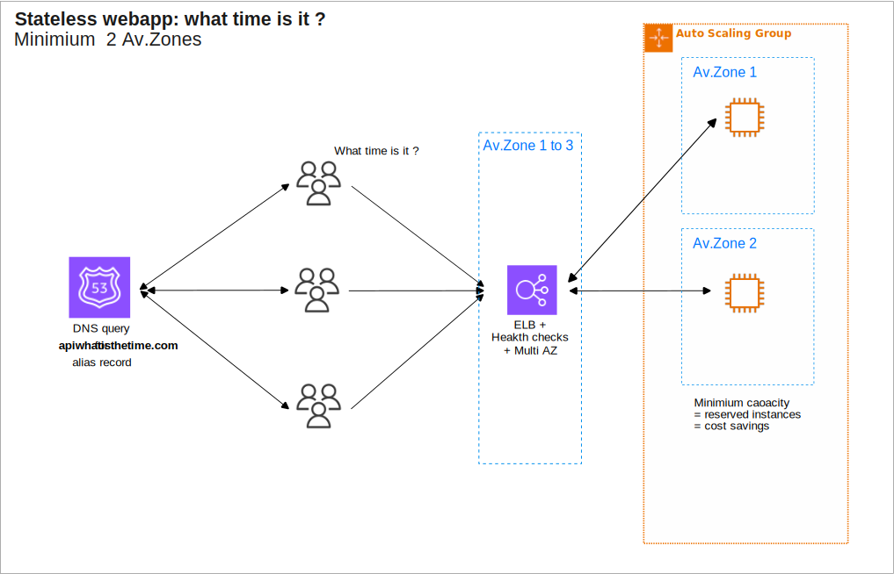

* [Return to table of contents](../../README.md)
# Stateless Web App: WhatIsTheTime.com
## Introduction
- WhatIsTheTime.com allows people to know what time it is
- We don’t need a database
- We want to start small (step by atep) and can accept downtime
- We want to fully scale vertically and horizontally, no downtime
- Let’s go through the Solutions Architect journey for this app

## Diagrams

