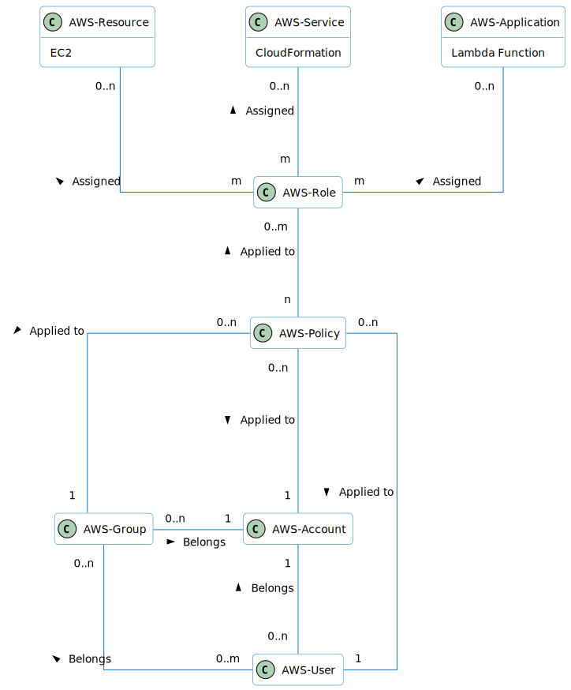

# IAM

## Domain Model
- IAM Users: Individual entities with granted access to AWS resources.
- Groups: to manage and apply policies to multiple users simultaneously.
- Policies: Define permissions and can be attached to Users, Groups or Roles. 
- Policies specify what actions are allowed or denied on what resources.
- Roles: Temporary sets of permissions (policies) assigned to AWS-Services. 
This services can act on behalf.
   
   
  

## Best practices
- IAM users and root accounts through multi-factor authentication (MFA)
- Flexible authorization model using IAM users, groups, roles, and policies.

## IAM Security tools
- IAM Credentials Report (account-level) \
A report that lists all your account's users and the status of their various
credentials
   
   
- IAM Access Advisor (user-level) \
   - Access advisor shows the service permissions granted to a user and when those
services were last accessed.
   - You can use this information to revise your policies.